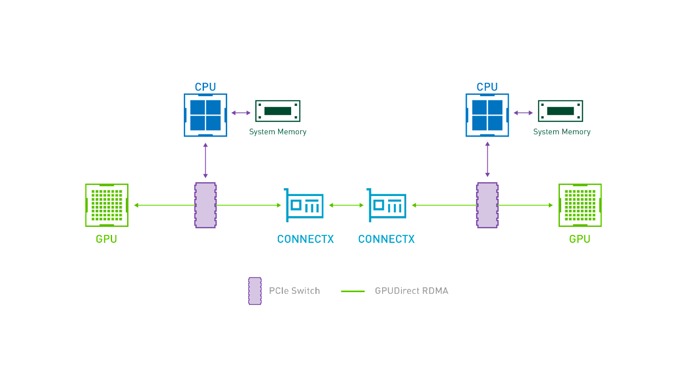

# 硬件平台

深度学习计算，尤其是大型模型的并行训练，需要高性能的硬件平台。这里的高性能体现在以下方面：

* 计算性能：尤其是浮点性能，用于模型的前向和反向计算
* 通信速度：用于并行训练中的设备间通信
* 内存大小：用于存放模型权重、激活、梯度等数据
* 存储容量：用于存放模型、数据集等的文件

针对深度学习计算进行专门优化的硬件设备和硬件平台正在快速迭代当中。

## 计算性能

每秒浮点运算次数（floating point operations per second，FLOPS）和每秒整数运算次数（integer operations per second，integer OPS）都是计算性能的度量标准。以 FLOPS 为例，所有单位前缀如下表所示：

| Name                                                 | Unit   | Value |
| ---------------------------------------------------- | ------ | ----- |
| [kilo](https://en.wikipedia.org/wiki/Kilo-)FLOPS     | kFLOPS | 10^3  |
| [mega](https://en.wikipedia.org/wiki/Mega-)FLOPS     | MFLOPS | 10^6  |
| [giga](https://en.wikipedia.org/wiki/Giga-)FLOPS     | GFLOPS | 10^9  |
| [tera](https://en.wikipedia.org/wiki/Tera-)FLOPS     | TFLOPS | 10^12 |
| [peta](https://en.wikipedia.org/wiki/Peta-)FLOPS     | PFLOPS | 10^15 |
| [exa](https://en.wikipedia.org/wiki/Exa-)FLOPS       | EFLOPS | 10^18 |
| [zetta](https://en.wikipedia.org/wiki/Zetta-)FLOPS   | ZFLOPS | 10^21 |
| [yotta](https://en.wikipedia.org/wiki/Yotta-)FLOPS   | YFLOPS | 10^24 |
| [ronna](https://en.wikipedia.org/wiki/Ronna-)FLOPS   | RFLOPS | 10^27 |
| [quetta](https://en.wikipedia.org/wiki/Quetta-)FLOPS | QFLOPS | 10^30 |

主要 NVIDIA GPU 的浮点性能如下表所示，其中 INT8 这一列的单位为 TOPS，其他列的单位为 TFLOPS：

| GPU       | FP64 | FP64 Tensor | FP32 | TF32 | FP16 | FP16 Tensor | BF16 Tensor | INT8 Tensor |
| --------- | ---- | ----------- | ---- | ---- | ---- | ----------- | ----------- | ----------- |
| V100 PCIe | 7    |             | 14   | \-   | 28   | 112         | \-          |             |
| V100 SXM  | 7.8  |             | 15.7 | \-   | 31.4 | 125         | \-          |             |
| RTX 3080  |      |             | 29.8 |      | 29.8 |             |             |             |
| RTX 3090  |      |             | 35.6 |      | 35.6 |             |             |             |
| A40       |      |             | 37.4 | 74.8 | 37.4 | 149.7       | 149.7       | 299.3       |
| A100      | 9.7  | 19.5        | 19.5 | 156  | 78   | 312         | 312         | 624         |
| RTX 4080  |      |             | 48.7 |      | 48.7 |             |             |             |
| RTX 4090  |      |             | 82.6 |      | 82.6 |             |             |             |
| H100 PCIe | 26   | 51          | 51   | 756  | 205  | 1513        | 1513        | 3026        |
| H100 SXM  | 34   | 67          | 67   | 989  | 268  | 1979        | 1979        | 3958        |

## 通信速度

!!! info "参考"
    * [【GPU 互联革命史】PCIe 到 NVLink，再到 NVSwitch 的成长故事 —— 看 GPU 如何推动 AI 与高性能计算！](https://www.bilibili.com/video/BV193BBYYEaG)
    * [【RDMA 深度科普】高效通信三剑客：RDMA 与 RoCE、InfiniBand 入门解读！](https://www.bilibili.com/video/BV1WokRYrEZw)
    * [AI 集群基础设施 InfiniBand 详解](https://zhuanlan.zhihu.com/p/673903240)

在并行训练中，GPU 之间的通信方式决定了通信速度，进而对总体训练时间有重大影响。常见的通信方式如下：

节点内通信：

* 共享内存：CPU 之间通过共享内存进行通信，速度最快，延迟最低。

* PCIe（Peripheral Component Interconnect Express）：PCIe 是一种计算机总线标准，用于连接主板上的各种设备，包括 GPU。PCIe 互连提供了一种相对简单和广泛支持的 GPU 间通信方式，但它的带宽相对较低，延迟相对较高，因为数据需要通过主板上的 PCIe 总线进行传输。

    标准带宽：

    * PCIe 4.0：31.5GB/s（x16，每个方向）
    * PCIe 5.0：63.0GB/s（x16，每个方向）
    * PCIe 6.0：126.0GB/s（x16，每个方向）


* NVLink：[NVLink](https://www.nvidia.com/en-us/data-center/nvlink/) 是一种由 NVIDIA 开发的高速、低延迟的 GPU 间互连技术。NVLink 通过直接连接 GPU 之间的通信通道，可以实现更高的带宽和更低的延迟。相对于 PCIe，NVLink 提供了更快速和更可靠的 GPU 间通信，特别适用于多 GPU 配置下的高性能计算和深度学习任务。

	NVSwitch 是 NVLink 的交换机，其提供所有连接到它的 GPU 之间的通信。

    标准带宽：（来源：
[NVLink and NVLink Switch](https://www.nvidia.com/en-us/data-center/nvlink/)）

| NVLink                                   | Second Generation          | Third Generation           | Fourth Generation           | Fifth Generation              |
| ---------------------------------------- | -------------------------- | -------------------------- | --------------------------- | ----------------------------- |
| NVLink bandwidth per GPU (bidirectional) | 300GB/s                    | 600GB/s                    | 900GB/s                     | 1,800GB/s                     |
| Maximum Number of Links per GPU          | 6                          | 12                         | 18                          | 18                            |
| Supported NVIDIA Architectures           | NVIDIA Volta™ architecture | NVIDIA Ampere architecture | NVIDIA Hopper™ architecture | NVIDIA Blackwell architecture |

| NVSwitch                                                     | First Generation           | Second Generation          | Third Generation            | Fourth Generation             |
| ------------------------------------------------------------ | -------------------------- | -------------------------- | --------------------------- | ----------------------------- |
| Number of GPUs with direct connection within a NVLink domain | Up to 8                    | Up to 8                    | Up to 8                     | Up to 576                     |
| NVSwitch GPU-to-GPU bandwidth (bidirectional)                | 300GB/s                    | 600GB/s                    | 900GB/s                     | 1,800GB/s                     |
| Total aggregate bandwidth                                    | 2.4TB/s                    | 4.8TB/s                    | 7.2TB/s                     | 1PB/s                         |
| Supported NVIDIA architectures                               | NVIDIA Volta™ architecture | NVIDIA Ampere architecture | NVIDIA Hopper™ architecture | NVIDIA Blackwell architecture |


节点间通信：

* TCP/IP (over Ethernet)：节点之间使用标准的 TCP/IP 协议进行通信，适用于一般的 GPU 间通信需求，尤其在小规模 GPU 集群和一般网络环境中使用。

    典型带宽：100Mbps/1Gbps/10Gbps


* RDMA (Remote Direct Memory Access)：RDMA 是一种高性能、低延迟的数据传输技术，它允许应用程序之间直接进行内存访问和数据传输，避免了 CPU 的参与，从而实现了极低的延迟和高带宽的应用间通信。RDMA 适用于对延迟和带宽要求非常高的高性能计算和大规模并行计算任务。


    * InfiniBand（IB）：InfiniBand 是一种用于高性能计算的网络通信标准，它具有极高的带宽和极低的延迟，用于节点之间的数据互连。InfiniBand 专为 RDMA 设计并提供 RDMA 能力，从硬件层面保证可靠传输。搭建 InfiniBand 网络需要专用的 IB 网卡、IB 交换机和 IB 线缆，成本较高。

        典型带宽：200Gbps/400Gbps/800Gbps

    * RoCE (RDMA over Converged Ethernet)：以太网上的 RDMA 实现。利用现有的标准以太网基础设施，但需要专用的 RoCE 网卡（HCA，host channel adapter）。

        典型带宽：100Gbps/200Gbps/400Gbps

    * GPUDirect RDMA：针对 NVIDIA GPU 的 RDMA 实现，它允许 GPU 和支持 RDMA 的设备（例如 IB/RoCE 网卡、支持 RDMA 的存储设备）之间直接通过 PCIe 总线进行数据传输，而无需经过 CPU 或系统内存。



对于同一物理节点上的 GPU，它们之间的连接方式可以通过以下命令获取：

```bash
nvidia-smi topo -m
```

例如 sm02 返回：

```
        GPU0    GPU1    GPU2    GPU3    CPU Affinity    NUMA Affinity   GPU NUMA ID
GPU0     X      SYS     SYS     SYS     0-9,20-29       0               N/A
GPU1    SYS      X      SYS     SYS     0-9,20-29       0               N/A
GPU2    SYS     SYS      X      SYS     10-19,30-39     1               N/A
GPU3    SYS     SYS     SYS      X      10-19,30-39     1               N/A

Legend:

  X    = Self
  SYS  = Connection traversing PCIe as well as the SMP interconnect between NUMA nodes (e.g., QPI/UPI)
  NODE = Connection traversing PCIe as well as the interconnect between PCIe Host Bridges within a NUMA node
  PHB  = Connection traversing PCIe as well as a PCIe Host Bridge (typically the CPU)
  PXB  = Connection traversing multiple PCIe bridges (without traversing the PCIe Host Bridge)
  PIX  = Connection traversing at most a single PCIe bridge
  NV#  = Connection traversing a bonded set of # NVLinks
```

对于同一物理节点上的 GPU，它们之间的 P2P 带宽和时延可以通过[此基准测试](https://gist.github.com/joshlk/bbb1aca6e70b11d251886baee6423dcb)得到。例如 sm02 返回：

```
[P2P (Peer-to-Peer) GPU Bandwidth Latency Test]
Device: 0, NVIDIA A100-PCIE-40GB, pciBusID: 18, pciDeviceID: 0, pciDomainID:0
Device: 1, NVIDIA A100-PCIE-40GB, pciBusID: 3b, pciDeviceID: 0, pciDomainID:0
Device: 2, NVIDIA A100-PCIE-40GB, pciBusID: 86, pciDeviceID: 0, pciDomainID:0
Device: 3, NVIDIA A100-PCIE-40GB, pciBusID: af, pciDeviceID: 0, pciDomainID:0
Device=0 CAN Access Peer Device=1
Device=0 CAN Access Peer Device=2
Device=0 CAN Access Peer Device=3
Device=1 CAN Access Peer Device=0
Device=1 CAN Access Peer Device=2
Device=1 CAN Access Peer Device=3
Device=2 CAN Access Peer Device=0
Device=2 CAN Access Peer Device=1
Device=2 CAN Access Peer Device=3
Device=3 CAN Access Peer Device=0
Device=3 CAN Access Peer Device=1
Device=3 CAN Access Peer Device=2

***NOTE: In case a device doesn't have P2P access to other one, it falls back to normal memcopy procedure.
So you can see lesser Bandwidth (GB/s) and unstable Latency (us) in those cases.

P2P Connectivity Matrix
     D\D     0     1     2     3
     0       1     1     1     1
     1       1     1     1     1
     2       1     1     1     1
     3       1     1     1     1
Unidirectional P2P=Disabled Bandwidth Matrix (GB/s)
   D\D     0      1      2      3 
     0 1151.22  10.78  10.78  10.89 
     1  10.73 1160.63  10.71  10.71 
     2  11.02  11.17 1289.79  11.22 
     3  11.09  11.19  11.40 1294.16 
Unidirectional P2P=Enabled Bandwidth (P2P Writes) Matrix (GB/s)
   D\D     0      1      2      3 
     0 1293.26  10.28   8.33   8.52 
     1  10.28 1306.44   7.71   7.69 
     2   7.94   8.72 1304.36  10.28 
     3   7.95   8.15  10.28 1304.02 
Bidirectional P2P=Disabled Bandwidth Matrix (GB/s)
   D\D     0      1      2      3 
     0 1313.65  12.35  15.67  15.78 
     1  12.39 1314.23  15.71  15.82 
     2  15.69  15.73 1315.60  16.09 
     3  15.70  15.80  16.09 1313.40 
Bidirectional P2P=Enabled Bandwidth Matrix (GB/s)
   D\D     0      1      2      3 
     0 1313.82  19.60  16.51  15.93 
     1  19.59 1315.25  15.88  16.11 
     2  16.58  15.98 1314.42  19.68 
     3  16.08  16.12  19.68 1313.65 
P2P=Disabled Latency Matrix (us)
   GPU     0      1      2      3 
     0   2.25  15.80  18.08  18.31 
     1  15.96   2.32  15.05  17.37 
     2  20.15  17.57   2.30  12.26 
     3  11.77  15.19  18.46   2.34 

   CPU     0      1      2      3 
     0   2.87   8.28   7.52   7.53 
     1   8.29   2.81   7.65   7.19 
     2   7.47   7.64   2.48   6.92 
     3   7.59  10.22   7.60   2.59 
P2P=Enabled Latency (P2P Writes) Matrix (us)
   GPU     0      1      2      3 
     0   2.25   1.92   2.00   1.99 
     1   1.92   2.31   1.99   2.02 
     2   2.00   1.99   2.31   1.93 
     3   2.02   1.98   1.91   2.33 

   CPU     0      1      2      3 
     0   2.92   2.31   2.19   2.15 
     1   2.38   2.94   2.16   2.21 
     2   2.22   1.99   2.59   2.31 
     3   2.23   2.03   2.14   2.54 

NOTE: The CUDA Samples are not meant for performance measurements. Results may vary when GPU Boost is enabled.
```

对于不同物理节点上的 GPU，它们之间的连接方式……

### NCCL

[NCCL](https://github.com/NVIDIA/nccl)（NVIDIA Collective Communications Library）是一个库，其提供了面向拓扑感知的 GPU 间通信原语，并可以轻松集成到应用程序中。NCCL 实现了集合通信和点对点发送/接收原语。它不是一个完整的并行编程框架，而是一个专注于加速 GPU 间通信的库。

NCCL 提供以下集合通信原语：

* AllReduce
* Broadcast
* Reduce
* AllGather
* ReduceScatter

此外，它还支持点对点的发送/接收通信，可以实现 Scatter、Gather 或 All-to-All 操作。

NCCL 方便地消除了开发人员针对特定机器进行应用程序优化的需求。NCCL 可以在节点内和节点间的多个 GPU 之间提供快速的集合通信。它支持多种互连技术，包括 PCIe、NVLink、InfiniBand Verbs 和 IP sockets。

NCCL 提供了一组有特定功能的环境变量：

```bash
# 指定 NCCL 通信算法
# Tree：树状算法，适用于多节点通信
# Ring：环状算法，适用于单节点通信
# CollnetDirect：直接通信，适用于单节点通信
# CollnetChain：链状通信，适用于单节点通信
# NVLS：NVLink 通信，适用于单节点通信
# NVLSTree：NVLink 树状通信，适用于多节点通信
NCCL_ALGO=Tree/Ring/CollnetDirect/CollnetChain/NVLS/NVLSTree

# 启用 NCCL 网络发现
NCCL_COLLNET_ENABLE

# 指定 NCCL 配置文件
NCCL_CONF_FILE=~/.nccl.conf

# 控制打印的调试信息
NCCL_DEBUG=VERSION/WARN/INFO/TRACE

# 重定向 NCCL 调试日志输出到指定文件
# 若不设置此环境变量，则默认重定向到 stdout
NCCL_DEBUG_FILE=/path/to/debug.log

# 强制启用或禁用 GPU Direct RDMA
# 默认会在拓扑允许的情况下启用 GPU Direct RDMA
NCCL_IB_CUDA_SUPPORT=0/1

# 禁用 InfiniBand 传输，强制使用 IP socket 传输
NCCL_IB_DISABLE=1

# 指定 RoCE 模式下的 GID 索引
NCCL_IB_GID_INDEX=-1

# 指定使用的 InfiniBand/RoCE 网卡
# 网卡越多，节点间通信带宽越大
NCCL_IB_HCA=mlx5_0

# 指定 InfiniBand Verbs 的超时时间
# 设为最大值 31，以减少 nccl timeout 异常
NCCL_IB_TIMEOUT=31

# 精细控制何时在 GPU 和 NIC 之间使用 GPU Direct RDMA
# LOC：不使用 GPU Direct RDMA（始终禁用）
# PIX：当 GPU 和 NIC 在同一个 PCI 交换机上时使用 GPU Direct RDMA
# PXB：当 GPU 和 NIC 通过 PCI 交换机连接时使用 GPU Direct RDMA（可能经过多个跳转）
# PHB：当 GPU 和 NIC 在同一个 NUMA 节点上时使用 GPU Direct RDMA，流量将通过 CPU
# SYS：即使跨越 NUMA 节点之间的 SMP 互联（如 QPI/UPI）也使用 GPU Direct RDMA（始终启用）
NCCL_NET_GDR_LEVEL=LOC/PIX/PXB/PHB/SYS

# 
NCCL_P2P_DIRECT_DISABLE=1

# 禁用 GPU 之间通过 NVLink 或 PCI 进行 CUDA 直接访问
NCCL_P2P_DISABLE=1

# 精细控制何时使用 P2P 通信
# 某些软硬件配置可能不支持 P2P 通信
# LOC：不使用 P2P（始终禁用）
# NVL：当 GPU 通过 NVLink 连接时使用 P2P
# PIX：当 GPU 在同一个 PCI 交换机上时使用 P2P
# PXB：当 GPU 通过 PCI 交换机连接时使用 P2P（可能经过多个跳转）
# PHB：当 GPU 在同一个 NUMA 节点上时使用 P2P，流量将通过 CPU
# SYS：即使跨越 NUMA 节点之间的 SMP 互联（如 QPI/UPI）也使用 P2P（始终启用）
NCCL_P2P_LEVEL=LOC/NVL/PIX/PXB/PHB/SYS

# 禁用 SHM 通信
# SHM 的通信速度介于 P2P 和 NET 之间；SHM 是 P2P 的备选方案，NET 是 SHM 的备选方案
NCCL_SHM_DISABLE=1

# 指定使用的 socket 网卡
NCCL_SOCKET_IFNAME=eth0

# 指定要加载的 XML 文件
NCCL_TOPO_FILE=/path/to/topo.xml

# 将检测到的拓扑保存到指定文件
NCCL_TOPO_DUMP_FILE=/path/to/topo-dump.xml
```

GPU 之间的集合通信带宽和时延可以通过 [nccl-tests](https://github.com/NVIDIA/nccl-tests) 得到。例如对于 sm02：

```bash
$ all_reduce_perf -b 8 -e 128M -f 2 -g 4
# nThread 1 nGpus 4 minBytes 8 maxBytes 134217728 step: 2(factor) warmup iters: 5 iters: 20 agg iters: 1 validation: 1 graph: 0
#
# Using devices
#  Rank  0 Group  0 Pid     19 on  nccl-test device  0 [0x18] NVIDIA A100-PCIE-40GB
#  Rank  1 Group  0 Pid     19 on  nccl-test device  1 [0x3b] NVIDIA A100-PCIE-40GB
#  Rank  2 Group  0 Pid     19 on  nccl-test device  2 [0x86] NVIDIA A100-PCIE-40GB
#  Rank  3 Group  0 Pid     19 on  nccl-test device  3 [0xaf] NVIDIA A100-PCIE-40GB
#
#                                                              out-of-place                       in-place          
#       size         count      type   redop    root     time   algbw   busbw #wrong     time   algbw   busbw #wrong
#        (B)    (elements)                               (us)  (GB/s)  (GB/s)            (us)  (GB/s)  (GB/s)       
           8             2     float     sum      -1    23.43    0.00    0.00      0    23.11    0.00    0.00      0
          16             4     float     sum      -1    23.00    0.00    0.00      0    22.90    0.00    0.00      0
          32             8     float     sum      -1    22.92    0.00    0.00      0    22.77    0.00    0.00      0
          64            16     float     sum      -1    23.34    0.00    0.00      0    22.69    0.00    0.00      0
         128            32     float     sum      -1    23.15    0.01    0.01      0    23.09    0.01    0.01      0
         256            64     float     sum      -1    23.13    0.01    0.02      0    22.80    0.01    0.02      0
         512           128     float     sum      -1    23.26    0.02    0.03      0    23.74    0.02    0.03      0
        1024           256     float     sum      -1    23.25    0.04    0.07      0    23.57    0.04    0.07      0
        2048           512     float     sum      -1    23.73    0.09    0.13      0    23.46    0.09    0.13      0
        4096          1024     float     sum      -1    23.92    0.17    0.26      0    23.64    0.17    0.26      0
        8192          2048     float     sum      -1    24.78    0.33    0.50      0    24.38    0.34    0.50      0
       16384          4096     float     sum      -1    30.66    0.53    0.80      0    30.48    0.54    0.81      0
       32768          8192     float     sum      -1    36.45    0.90    1.35      0    35.93    0.91    1.37      0
       65536         16384     float     sum      -1    54.10    1.21    1.82      0    54.40    1.20    1.81      0
      131072         32768     float     sum      -1    86.34    1.52    2.28      0    85.72    1.53    2.29      0
      262144         65536     float     sum      -1    123.5    2.12    3.18      0    122.6    2.14    3.21      0
      524288        131072     float     sum      -1    191.3    2.74    4.11      0    187.5    2.80    4.19      0
     1048576        262144     float     sum      -1    316.8    3.31    4.96      0    307.6    3.41    5.11      0
     2097152        524288     float     sum      -1    546.8    3.84    5.75      0    631.6    3.32    4.98      0
     4194304       1048576     float     sum      -1   1372.4    3.06    4.58      0   1255.0    3.34    5.01      0
     8388608       2097152     float     sum      -1   2263.7    3.71    5.56      0   2449.5    3.42    5.14      0
    16777216       4194304     float     sum      -1   5214.7    3.22    4.83      0   4979.8    3.37    5.05      0
    33554432       8388608     float     sum      -1    11398    2.94    4.42      0    12808    2.62    3.93      0
    67108864      16777216     float     sum      -1    18726    3.58    5.38      0    18558    3.62    5.42      0
   134217728      33554432     float     sum      -1    38693    3.47    5.20      0    40147    3.34    5.01      0
# Out of bounds values : 0 OK
# Avg bus bandwidth    : 2.19202 
#
```

### OpenMPI

### Gloo

### Horovod
