# 并行策略、计算加速与内存优化技术

!!! info "推荐阅读"
    * [Performance and Scalability](https://huggingface.co/docs/transformers/v4.47.1/en/performance)
    * [DeepSpeed: Extreme-scale model training for everyone](https://www.microsoft.com/en-us/research/blog/deepspeed-extreme-scale-model-training-for-everyone/)

## 数据并行（Data Parallelism，DP）

模型被复制到多个设备上，训练数据的每个 batch（批次）被平均分为多个 mini-batch（小批次），在这些设备上并行处理。每个设备上计算的梯度被聚合（all reduce），用于更新模型参数。

[ZeRO-DP](#zero-dp) 消除 DP 进程之间的内存冗余，并保持 DP 的计算/通信效率。

## 模型并行（Model Parallelism，MP）

由于单个设备无法容纳整个模型，模型的所有层被划分为若干个组，分别放置在不同的设备上。每个设备负责计算被分配的层，并将激活传递给其他设备进行进一步的处理和传递。

（朴素）MP 的主要问题是，在任意时刻只有一个设备工作，并且设备之间还有复制数据的通信开销。因此，4x 8G GPU 的计算比 1x 32G GPU 的训练还要慢，因为前者还有通信开销（假设 8G GPU 和 32G GPU 的计算能力相同）。

### 流水线并行（Pipeline Parallelism，PP）

!!! note "注意"
    有些文档将 PP 称为垂直（vertical）并行。微软的 DeepSpeed 系列论文或博客将 PP 称为水平（horizontal）并行。

!!! info "参考"
    * [1811.06965](https://arxiv.org/abs/1811.06965)

PP 通过进一步拆分 mini-batch 为 micro-batch，使不同的 micro-batch 能够并行处理，压缩了流水线中的 bubble，从而提高了计算效率。

mini-batch 被拆分出的 micro-batch 数量是一个超参数，称为 chunks（在 DeepSpeed 中即为超参数 gradient_accumulation_steps）。当 chunks=1 时，PP 退化为（朴素）MP；当 chunks=4 × pipeline stages 时，设备使用率达超过 80%；当 chunks=8 × pipeline stages 时，设备使用率达到 88%。但当 chunks 过大时，micro-batch size 过小亦可能损害计算效率（对于较小的模型），因此需要测试找到使设备计算效率最高的 chunks 值。

为追求设备使用率，令 mini-batch size = n × pipeline stages × micro-batch size 可能导致 mini-batch size 过大，进而导致 total batch size 过大影响收敛，即使有 micro-batch size = 1（对于较大的模型）。此外，每个设备上激活的显存占用与 mini-batch size 成正比，mini-batch size 较大也会使激活的显存占用较多。


### 张量并行（Tensor Parallelism，TP）

!!! note "注意"
    有些文档将 TP 称为水平（horizontal）并行或 Megatron-style 并行。微软的 DeepSpeed 系列论文或博客将 TP 称为 MP 或垂直（vertical）并行。

!!! info "参考"
    * [1909.08053](https://arxiv.org/abs/1909.08053)
    * [2104.04473](https://arxiv.org/abs/2104.04473)
    * [2205.05198](https://arxiv.org/abs/2205.05198)

矩阵相乘（GeMM）有多种并行化方法，下面是其中两种：

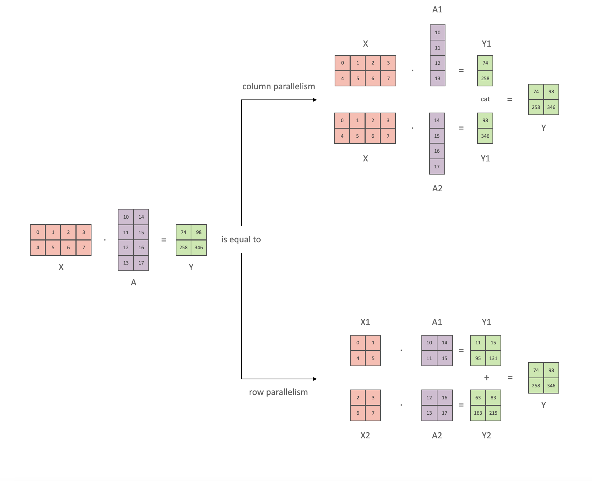

对于 transformer 块中的两层 MLP 和自注意力机制，分别应用上述并行化方法（自注意力机制的并行是通过划分注意力头），如下图所示，即为张量并行。

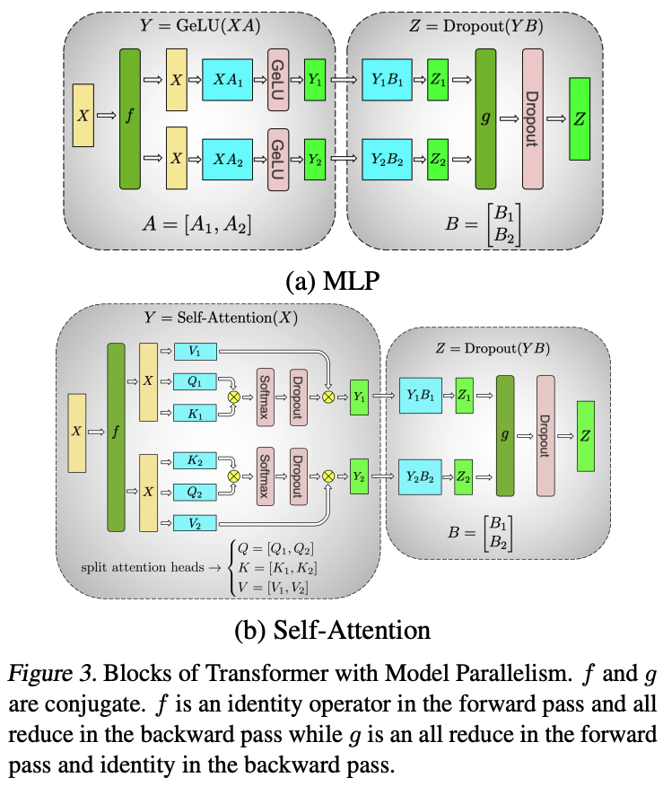

在前向计算中，f 是恒等操作，g 是 all-reduce 操作；在反向计算中，g 是恒等操作，f 是 all-reduce 操作。因此一个 transformer 层在前向和反向计算各需要 2 次 all-reduce。

以 GPT-3 1.3B 为例，其拥有 24 个 transformer 层，故每个训练 step 都需要 96 次 all-reduce。all-reduce 的对象是激活，设 batch size 为 32，序列长度为 1024，则激活的 element 数量为 32×1024×2048=67M，总共 all-reduce 的 element 数量为 67M×96=6.4B。作为比较，数据并行每个训练 step 只需要 1 次 all-reduce，对象是梯度，element 数量为 1.3B。

由此可见，张量并行的通信次数多，通信量大，对 GPU 间通信的带宽和时延提出了很高的要求。建议实践中只在节点内使用张量并行，最好 GPU 之间还有 NVLink 连接。

对于丢弃、层归一化和残差连接，所有 GPU 都执行完全相同的计算（如下图所示），通过复制层归一化参数到所有 GPU，以及设置相同的随机数种子来实现。GPU 之间无需通信模型参数。


对于嵌入层，其权重矩阵也沿词汇表维度分割，并且需要 all-reduce 操作。详见原论文。

## 2D 并行（2D Parallelism）& 3D 并行（3D Parallelism）

(ZeRO-)DP、PP 和 TP 在提高内存效率和计算效率上有各自的功能，2D 并行结合使用其中两种，而 3D 并行结合使用三种。

|                | ZeRO-DP                                                              | PP                                                                              | TP                                                                                                     |
| -------------- | -------------------------------------------------------------------- | ------------------------------------------------------------------------------- | ------------------------------------------------------------------------------------------------------ |
| 总计算效率     | 小规模时几乎等比例增加<br>大规模时受带宽限制，与设备数量和参数量有关 | 相比等比例增加有损失，chunks 不能过大或过小<br>stage 不能过多，并且需要负载均衡 | 小规模时几乎等比例增加<br>大规模时受带宽限制，受每设备计算效率限制<br>并行度不能过高，并且需要负载均衡 |
| 每设备使用内存 | 激活/优化器状态/梯度/参数等比例减少                                  | 参数和激活等比例减少                                                            | 参数等比例减少，激活等比例减少（需要 ZeRO-R）                                                          |
| 通信开销       | 中<br>ZeRO-3 增加通信开销                                            | 小<br>Stage 越多通信开销越大                                                    | 大<br>跨节点需要高带宽互联                                                                             |
| 其他           | 实现简单，应用广泛，首选的并行方法                                   |                                                                                 | Megatron-LM 实现了 TP，但仅支持有限模型<br>不改变 batch size，因而不影响收敛                           |

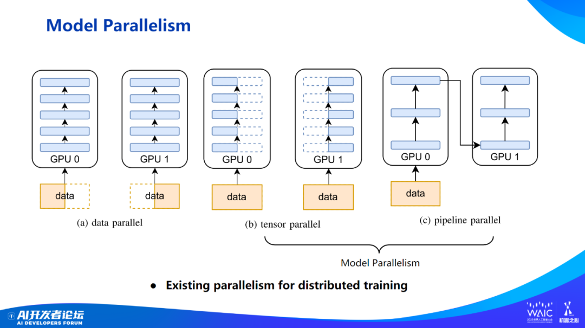

两路 DP + 两阶段 PP 的示例如下：

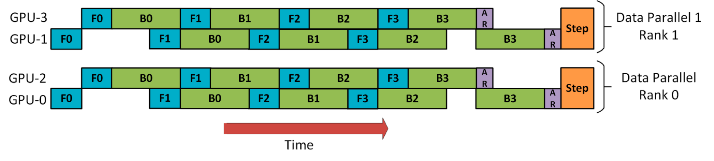

注意这里 DP rank 0（rank 1）不知道 GPU 2（GPU 3）的存在，DP 只是在 GPU 0 和 1 之间进行，而 GPU 0 “秘密地”使用 PP 将其部分负载卸载到 GPU 2 上。

两路 DP + 四阶段 PP + 四阶段 TP 的示例如下：


这里所有 TP（图中写作 MP）组（沿深度的 4 个工作器）都在节点内部，因为其通信开销最大；所有 PP 组（横向的 4 个工作器）都跨节点，因为其通信开销最小；在 TP 没有覆盖节点所有工作器的情况下，所有 DP 组（纵向的 2 个工作器）也在节点内部。

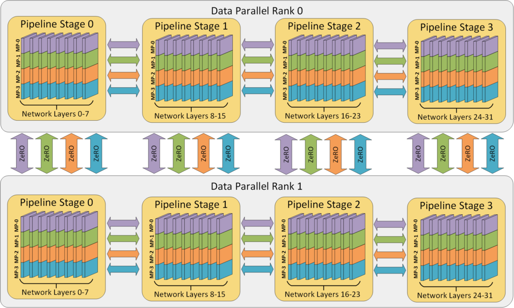

这里 DP 并行度为 2，之后不管 PP 和 TP（图中写作 MP）并行度为多少，DP 所造成的总的通信开销都是固定的。与此同时，由于 PP 和 TP 的存在，每个 DP 组的通信开销（梯度聚合）被均摊而降低，又因为所有 DP 组的通信并行执行并且在节点内执行（GPU 直接通信），最终 DP 的通信速度等比例（PP degree × TP degree）增加。反过来看，通信速度的增加允许 DP 有更小的 mini-batch。

对于 PP 同理，其并行度为 4，之后不管 TP 并行度为多少，PP 所造成的总的通信开销都是固定的。尽管由于 TP 的存在，每个 PP 组的通信开销（激活传递）被均摊而降低，但因为所有 PP 组的并行通信都是跨节点的网络通信，它们共用网络信道，最终 PP 的通信速度没有变化。

ZeRO-DP Stage ≥ 2 和 PP 不建议并用，因为此时部分设备不储存梯度，每计算一个 micro-batch 的梯度都需要复制到其他设备上（做一次 reduce-scatter 操作），大幅增加了通信开销。

ZeRO-DP Stage 1 和 PP 并用时，可以利用 ZeRO-Offload 将优化器状态卸载到 CPU 内存中。

3D Parallelism 要达到最高的计算吞吐量，需要在 DP、PP 和 TP 的 degree 之间达成平衡。

## Sequence Parallelism（SQ，序列并行）

## Gradient Accumulation（梯度累积）

将 mini-batch（小批次）拆分为 micro-batch（微批次），进行多次前向和反向计算，在本地累积梯度，最后进行梯度聚合并执行优化器步骤。

这样做的好处在于：

* 对于 PP 提高设备计算效率
* 对于 DP 减少内存使用

PP 中为了提高设备计算效率而拆分 mini-batch，与 DP 中因为内存不足而拆分 mini-batch 实际上是一个操作，在 DeepSpeed 中共用一个超参数 `gradient_accumulation_steps`。

## Activation Checkpointing

!!! note "注意"
    有些文档将 Activation Checkpointing 称为 Gradient Checkpointing。

!!! info "参考"
    * [1604.06174](https://arxiv.org/abs/1604.06174)

由于大多数梯度算子都依赖于前向传递的中间结果（即激活），因此在训练 $n$ 层网络（这里的层不应再有中间结果，否则进一步拆分）时，需要 $O(n)$ 的内存来存储中间结果。为了减少内存使用，Activation Checkpointing 方法丢弃一些中间结果，在反向计算需要这些中间结果时，通过从最近的结果重新前向计算来恢复它们。

具体来说，我们把 $n$ 层网络分为 $k$ 段，段之间的输入输出被保留，段内的所有中间结果被丢弃。在反向计算到某一段时，这一段内的中间结果会重新计算。因此，我们只需要支付存储 $k$ 段的输入输出的内存成本，以及在每一段执行反向计算的最大内存成本：

$$
\mbox{cost-total}=\max_{i=1,\cdots,k}\mbox{cost-of-segment}(i)+O(k)=O(\frac{n}{k})+O(k)
$$

令 k 接近于 $\sqrt{n}$，则总成本约为 $O(2\sqrt{n})$。

此方法需要一次额外的前向计算，考虑到反向计算的计算量约为前向计算的 2 倍，此方法会增加 1/3 的计算成本。

## ZeRO

!!! info "参考"
    * ZeRO：[1910.02054](https://arxiv.org/abs/1910.02054)
    * ZeRO-offload：[2101.06840](https://arxiv.org/abs/2101.06840)
    * ZeRO++：[2306.10209](https://arxiv.org/abs/2306.10209)

ZeRO（Zero Redundancy Optimizer）是一套强大的**内存优化**技术，能够有效地训练拥有数 T 参数的大型模型。与其他并行方法相比，ZeRO 的一个关键优势是无需对模型代码进行修改。

### ZeRO-DP

数据并行复制模型和优化器到所有的工作器，因此内存不高效。ZeRO-DP（以下简称 ZeRO）利用数据并行的内存和计算资源，降低了用于模型训练的每个设备（GPU）的内存和计算需求。ZeRO 通过将各种模型训练状态（权重、梯度和优化器状态）在并行训练硬件中的可用设备（GPU 和 CPU）之间进行分割，从而降低了每个 GPU 的内存消耗。具体而言，ZeRO 被实现为逐级递增的三个优化 stage，分别对应于优化器状态、梯度和参数的分割：

1. 分割优化器状态：每个进程仅保留其被分配的优化器状态，仅更新其优化器状态和对应的参数；不增加通信量。
1. 增加分割梯度：每个进程仅保留与其优化器状态对应的梯度；不增加通信量。
1. 增加分割参数：每个进程仅保留与其优化器状态和梯度对应的参数；在前向和反向计算过程中自动收集其他分片的参数；增加 50% 的通信量。

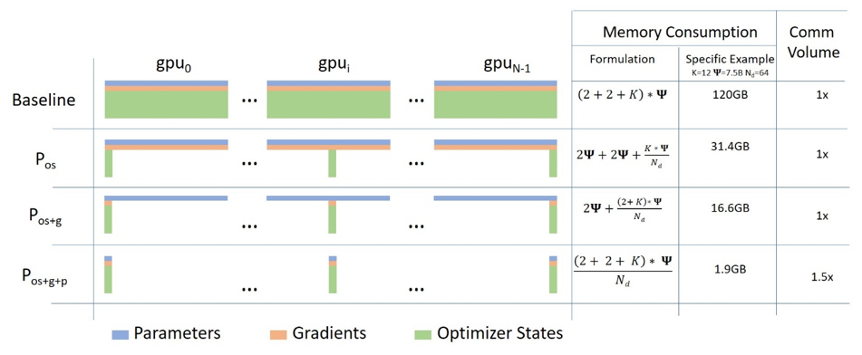

在 DP 训练中，所有 DP 进程的梯度会在每一个 step 的反向计算的最后进行平均。这种平均操作通过使用 all-reduce 操作来完成。现代的 all-reduce 实现采用两步方法：第一步是 reduce-scatter 操作，它在不同的进程上 reduce 数据的不同分片；第二步是 all-gather 操作，其中每个进程将所有进程上的 reduced 数据收集起来。reduce-scatter 和 all-gather 都使用流水线方法实现，每个操作的数据移动量为 (n-1)Ψ（对于具有 Ψ 个参数的模型，单位为半精度浮点数）。因此在每个 step 中，标准的 DP 方法会产生 2(n-1)Ψ 的数据移动量。

ZeRO-1 和 ZeRO-2 与上述方法的区别在于 all-gather 操作是对（FP16 模型的）参数而非梯度进行，但这并没有增加通信量，因此也没有增加总通信量。

ZeRO-3 的每个 DP 进程只存储它更新的（FP16 模型的）参数，因此在前向计算期间，它需要接收所有其他分片的参数。然而，可以通过流水线方法避免内存开销：在计算特定分片的前向计算之前，负责该分片的 DP 进程将参数广播到所有 DP 进程；完成该分片的前向计算后，即丢弃这些参数。因此，总通信量为 (n-1)Ψ。换言之，我们将参数的 all-gather 操作分散到整个前向计算过程中，并在使用后丢弃参数。之后在反向计算中，这个 all-gather 操作以逆序再次进行，另外还有梯度的 reduce-scatter 操作。因此，总的通信量为 3(n-1)Ψ，相较于基线增加了 50%。

此外，ZeRO-3 还包括无限卸载引擎，形成 ZeRO-Infinity，可以将数据卸载到 CPU 和 NVMe 内存中，以实现巨大的内存节省。

### ZeRO-R

张量并行在设计上需要在进程间维护相同的激活，造成了内存上的冗余。ZeRO-R 通过对激活进行分割从而消除了这种冗余。更具体地说，一旦前向计算完模型的某一层，输入激活就会在张量并行进程之间进行分割，直到其在反向计算中再次被需要。此时，ZeRO-R 使用一次 all-gather 操作来恢复激活的完整形式。它与 Activation Checkpointing 方法兼容，仅存储被分割的激活检查点。此外，在模型非常大且设备内存非常有限的情况下，这些被分割的激活检查点还可以被卸载到 CPU，以减少激活内存开销到几乎为零，但会增加额外的通信开销（在 GPU 显存和 CPU 内存之间移动一个来回）。

此外，ZeRO-R 还：

* 使用固定长度的缓冲区以防止缓冲区占用过多内存。
* 通过为激活检查点和参数梯度（step 内的长期存活对象）预分配连续的内存块来减少内存碎片。

### ZeRO-Offload

对于大型模型的训练，像 Adam 这样的优化器可能会占用大量的 GPU 计算和内存资源。ZeRO-Offload 利用主机 CPU 上的计算和内存资源来执行优化器，从而降低了这些模型的 GPU 计算和内存需求。此外，为了防止优化器成为瓶颈，ZeRO-Offload 使用了 DeepSpeed 的高度优化的 Adam CPU 实现，称为 DeepSpeedCPUAdam。DeepSpeedCPUAdam 比标准的 PyTorch 实现快 5 倍至 7 倍。

ZeRO-Offload 通过将数据和计算卸载到 CPU 上，实现了大型模型的训练。为了保持计算效率，它被设计成最小化与 GPU 之间的数据传输，同时减少 CPU 计算时间，同时最大程度地节省 GPU 内存。因此，与仅使用 PyTorch 进行 1.4 亿参数模型的训练相比，ZeRO-Offload 可以在单个 NVIDIA V100 GPU 上为具有 100 亿参数模型的训练实现每秒 40 TFlops 的性能，而后者只能达到 30 TFlops。此外，当有多个 GPU 可用时，ZeRO-Offload 可以扩展到多个 GPU 上，实现几乎线性的加速，最多可扩展到 128 个 GPU。此外，它还可以与模型并行一起工作，使得在单个 DGX-2 服务器（拥有 16x V100 GPU）上可以训练具有超过 700 亿参数的模型，与仅使用模型并行相比，模型尺寸增加了 4.5 倍。

ZeRO-Offload 是 ZeRO-2 的扩展。

ZeRO-Offload 通过充分利用 GPU 和其主机 CPU 上的计算和内存资源，将利用有限 GPU 资源能够高效训练的模型大小的边界进一步推进。它允许在单个 NVIDIA V100 GPU（32 GB）上训练多达 13B 参数的模型，同时保持每个 GPU 的高训练吞吐量超过 30 TFLOPS。

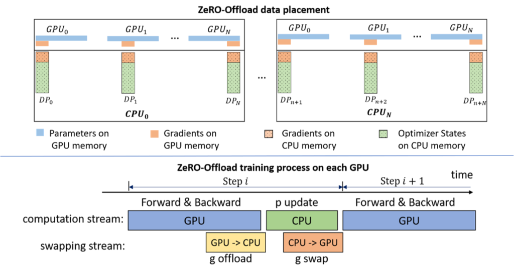

### ZeRO-Infinity

### ZeRO++

ZeRO++ 是建立在 ZeRO 之上的通信优化策略系统，无论规模大小或跨设备带宽限制如何，都为大型模型训练提供了无与伦比的效率。

ZeRO++ 由三个关键设计组成，分别是量化权重（qwZ）、分层分片（hpZ）和量化梯度（qgZ）：

1. qwZ 采用基于块的量化技术，将 ZeRO 参数的全局汇总通信量从 FP16 降低到 INT8，减半通信量。
1. hpZ 通过数据重映射和重新计算来消除节点间的反向参数全局汇总通信。
1. qgZ 使用一种新的通信高效的全对全基于量化的梯度平均替代了梯度全局汇总集合。

总体而言，这三项优化可以将通信量与 ZeRO 基准相比减少 4 倍。这三个组件中的每一个都可以独立启用，也可以作为一个整体集体启用。

## 数值精度

现代神经网络的高效训练与推理通常依赖于使用较低精度的数据类型。在 A100 GPU 上，FP16 矩阵乘法和卷积的峰值性能比 FP32 的峰值性能快 16 倍。由于 FP16 和 BF16 数据类型的大小仅为 FP32 的一半，它们可以使受带宽限制的内核性能提升一倍，并减少训练网络所需的内存，从而允许使用更大的模型、更大的批次或更大的输入，进而提高性能。

### 浮点类型

常用浮点类型的位数分配如图：

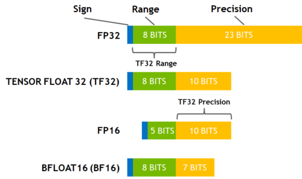

**FP32**：在 PyTorch 中，默认情况下浮点张量和模块都以 FP32 精度创建，但这是一个历史遗留问题，并不能代表大多数现代深度学习网络的训练需求。网络很少需要这么高的数值精度。

**FP16 & BF16**：这两种低精度浮点数据类型通常具有相似的速度，但有些网络可能只能在其中一种类型上收敛。如果一个网络需要更高的精度，可能需要使用 FP16，如果一个网络需要更大的动态范围，可能需要使用 BF16，其动态范围与 FP32 相等。如果观察到溢出等问题，建议尝试使用 BF16。BF16 仅在 Ampere 及后续架构的 CUDA 设备上可用。

**TF32**：TF32 是 NVIDIA Ampere GPU 新引入的数学模式（而非数据类型），其在第三代 Tensor Core 上执行 FP32 浮点数的矩阵相乘和卷积运算。计算流程如图所示，和全 FP32 精度计算的区别仅在于将输入在相乘之前舍入到 TF32 精度。

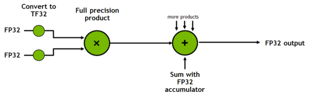

TF32 相比 FP32 有相同的数值范围但更低的数值精度。根据 NVIDIA 的研究，大多数模型训练都不会受到影响，并且显示出与 FP32 精度训练相同的收敛性和准确率。默认情况下，PyTorch 仅为卷积启用 TF32 模式，而没有矩阵乘法。建议也为矩阵乘法启用此设置，除非网络需要全 FP32 精度。TF32 仅在 Ampere 及后续架构的 CUDA 设备上可用。

!!! info "TF32"
    * [TensorFloat-32 in the A100 GPU Accelerates AI Training, HPC up to 20x](https://blogs.nvidia.com/blog/2020/05/14/tensorfloat-32-precision-format/)
    * [Accelerating AI Training with NVIDIA TF32 Tensor Cores](https://developer.nvidia.com/blog/accelerating-ai-training-with-tf32-tensor-cores/)

### 混合精度训练

!!! info "参考"
    * [1710.03740](https://arxiv.org/abs/1710.03740)
    * [Mixed precision training](https://docs.fast.ai/callback.fp16.html#A-little-bit-of-theory)

以 FP16 混合精度训练为例，模型参数在显存中有 FP32 和 FP16 两个副本，训练循环如下：

1. FP16 模型以 FP16 前向计算激活、输出和损失。
1. 放大损失，FP16 模型以 FP16 反向计算梯度。
1. 转换梯度为 FP32 精度，等比例缩小梯度。
1. 优化器以 FP32 更新 FP32 模型的参数。
1. 复制 FP32 模型到 FP16 模型。

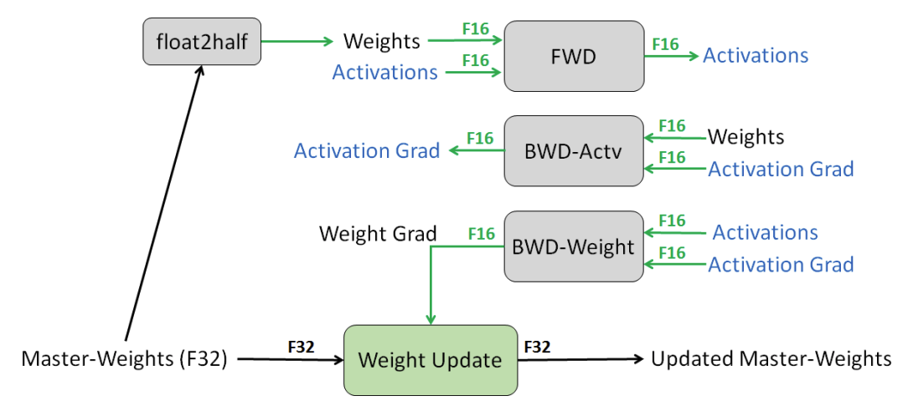

说明：

* 在前向和反向计算时使用 FP16 模型以提高速度，在更新参数时使用 FP32 模型以保证精度。
* 为防止以 FP16 计算梯度时下溢，先放大损失和梯度，将梯度转换为 FP32 精度后再缩小。损失的放大系数是一个超参数，我们希望它尽可能地大以使得尽量多的梯度不下溢，并且充分利用 FP16 精度的表示范围，但又不能使得损失或任意梯度上溢。常用的策略是，初始时尝试一个非常大的值（如 65536），每次减半直到没有发生上溢；当若干次迭代都没有发生上溢时，加倍（因为随着训练的进行，梯度将逐渐变小）。
* 等比例缩小梯度后可以按需裁剪梯度。

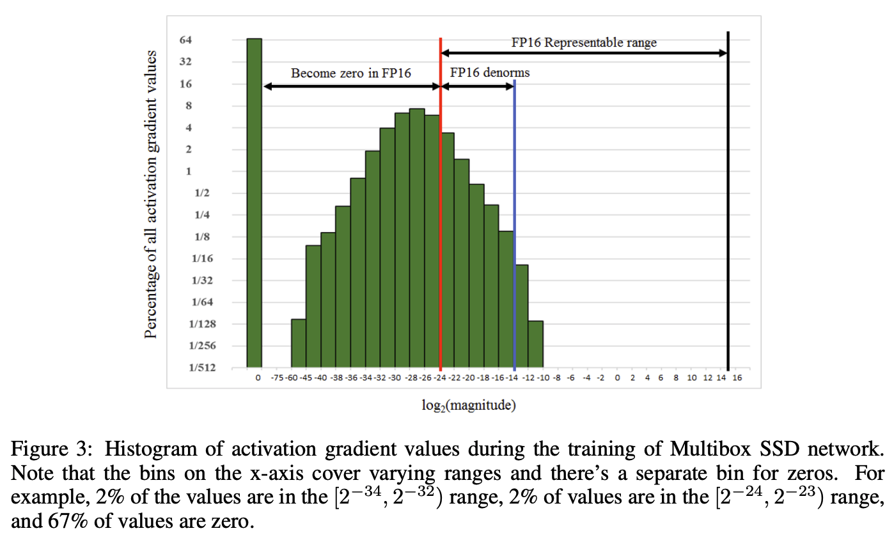

对于 BF16 混合精度训练，其不同之处在于不需要放大损失。

训练过程中的显存/内存占用如下（其中 Ψ 为模型参数量）：

|                    | 显存/内存占用（Bytes）                                           | 备注                                                                      |
| ------------------ | ---------------------------------------------------------------- | ------------------------------------------------------------------------- |
| 模型参数           | (4 + 2) Ψ                                                        | 相比单精度增加 2Ψ Bytes                                                   |
| 梯度               | 2Ψ                                                               | 亦有文档算作 4Ψ，如果转换所有梯度再更新参数                               |
| 优化器参数（Adam） | 8Ψ                                                               | ZeRO 的论文将模型参数的 4Ψ 算在优化器参数中，因为其并不参与前向和反向计算 |
| 激活               | ∝batch size, hidden size, sequence length, number of layer,  etc | 相比单精度减半                                                            |

### 训练的最佳实践

!!! info "参考"
    * [What Every User Should Know About Mixed Precision Training in PyTorch](https://pytorch.org/blog/what-every-user-should-know-about-mixed-precision-training-in-pytorch/)

* 训练网络时尽可能使用混合精度和 TF32 模式。两者可以同时使用。

    ```python
    # Mixed Precision
    from torch.cuda.amp import autocast
    with autocast(dtype=torch.bfloat16):
        loss, outputs = ...

    # TF32
    import torch
    torch.backends.cuda.matmul.allow_tf32 = True
    torch.backends.cudnn.allow_tf32 = True
    ```

* 使用混合精度时，尽可能令 batch size 为 8 的倍数以充分利用 Tensor Core。
* 尽管 BF16 和 FP16 具有类似的理论性能优势，但在实践中它们的速度可能会有所不同。建议尝试使用两种数据格式，并选择在保持所需数值行为的前提下速度最佳的数据格式。
* 不要在训练同一网络时交替使用 BF16 和 FP16。例如，以 FP16 微调 BF16 预训练模型可能会由于 BF16 训练具有潜在的较大范围而导致范围问题，因此如果模型是以 BF16 训练的，则用户应该坚持使用 BF16 进行微调。
* 若训练精度低影响收敛，尝试 TF32 模式；若仍然精度敏感，使用完全的 FP32 精度。

### 量化

