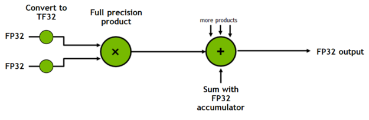

# 并行训练、计算加速与内存优化技术

## Data Parallelism（DP，数据并行）

## Model Parallelism（MP，模型并行）

### Pipeline Parallelism（PP，流水线并行）

### Tensor Parallelism（TP，张量并行）

## 2D Parallelism（2D 并行）& 3D Parallelism（3D 并行）

## Sequence Parallelism（SQ，序列并行）

## ZeRO

### ZeRO-DP

### ZeRO-R

### ZeRO-Offload

### ZeRO-Infinity

### ZeRO++

## 数值精度

现代神经网络的高效训练与推理通常依赖于使用较低精度的数据类型。在 A100 GPU 上，FP16 矩阵乘法和卷积的峰值性能比 FP32 的峰值性能快 16 倍。由于 FP16 和 BF16 数据类型的大小仅为 FP32 的一半，它们可以使受带宽限制的内核性能提升一倍，并减少训练网络所需的内存，从而允许使用更大的模型、更大的批次或更大的输入，进而提高性能。

### 浮点类型

常用浮点类型的位数分配如图：

**FP32**：在 PyTorch 中，默认情况下浮点张量和模块都以 FP32 精度创建，但这是一个历史遗留问题，并不能代表大多数现代深度学习网络的训练需求。网络很少需要这么高的数值精度。

**FP16 & BF16**：这两种低精度浮点数据类型通常具有相似的速度，但有些网络可能只能在其中一种类型上收敛。如果一个网络需要更高的精度，可能需要使用 FP16，如果一个网络需要更大的动态范围，可能需要使用 BF16，其动态范围与 FP32 相等。如果观察到溢出等问题，建议尝试使用 BF16。BF16 仅在 Ampere 及后续架构的 CUDA 设备上可用。

**TF32**：TF32 是 NVIDIA Ampere GPU 新引入的数学模式（而非数据类型），其在第三代 Tensor Core 上执行 FP32 浮点数的矩阵相乘和卷积运算。计算流程如上图所示，和全 FP32 精度计算的区别仅在于将输入在相乘之前舍入到 TF32 精度。

TF32 相比 FP32 有相同的数值范围但更低的数值精度。根据 NVIDIA 的研究，大多数模型训练都不会受到影响，并且显示出与 FP32 精度训练相同的收敛性和准确率。默认情况下，PyTorch 仅为卷积启用 TF32 模式，而没有矩阵乘法。建议也为矩阵乘法启用此设置，除非网络需要全 FP32 精度。TF32 仅在 Ampere 及后续架构的 CUDA 设备上可用。

!!! info "TF32"
    * [TensorFloat-32 in the A100 GPU Accelerates AI Training, HPC up to 20x](https://blogs.nvidia.com/blog/2020/05/14/tensorfloat-32-precision-format/)
    * [Accelerating AI Training with NVIDIA TF32 Tensor Cores](https://developer.nvidia.com/blog/accelerating-ai-training-with-tf32-tensor-cores/)

### 混合精度训练

[1710.03740](https://arxiv.org/abs/1710.03740)

### 训练的最佳实践

!!! info "参考"
    * [What Every User Should Know About Mixed Precision Training in PyTorch](https://pytorch.org/blog/what-every-user-should-know-about-mixed-precision-training-in-pytorch/)

### 量化

