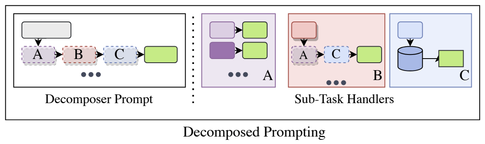
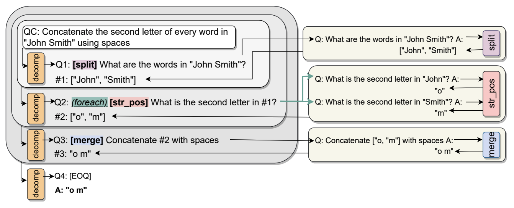
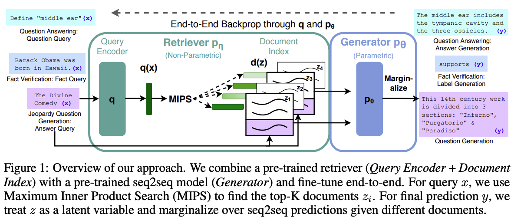

# 应用

LLM 应用广泛，但不同的应用类型之间并没有明显的界限。这里选取一些主题进行讨论。

## 聊天机器人

用结构化的模板引导 LLM 生成与用户聊天的内容。例如下面展示了传入 Llama-2-7b-chat-hf 模型的 token 序列：

```python
>>> from transformers import AutoTokenizer
>>> tokenizer = AutoTokenizer.from_pretrained("meta-llama/Llama-2-7b-chat-hf")
>>> tokenizer.use_default_system_prompt = False
>>> conversation = [
{"role": "system", "content": "You are a helpful assistant."}
{"role": "user", "content": "Hello, how are you?"},
{"role": "assistant", "content": "I'm doing great. How can I help you today?"},
{"role": "user", "content": "I'd like to show off how chat templating works!"},
 ]
>>> tokenizer.apply_chat_template(conversation, tokenize=False)
"<s>[INST] <<SYS>>\nYou are a helpful assistant.\n<</SYS>>\n\nHello, how are you? [/INST] I'm doing great. How can I help you today? </s><s>[INST] I'd like to show off how chat templating works! [/INST]"
>>> tokenizer.apply_chat_template(conversation, return_tensors="pt")
tensor([[    1,   518, 25580, 29962,  3532, 14816, 29903,  6778,    13,  3492,
           526,   263,  8444, 20255, 29889,    13, 29966,   829, 14816, 29903,
          6778,    13,    13, 10994, 29892,   920,   526,   366, 29973,   518,
         29914, 25580, 29962,   306, 29915, 29885,  2599,  2107, 29889,  1128,
           508,   306,  1371,   366,  9826, 29973, 29871,     2,     1,   518,
         25580, 29962,   306, 29915, 29881,   763,   304,  1510,  1283,   920,
         13563,  1350,   572,  1218,  1736, 29991,   518, 29914, 25580, 29962]])

# 其中：
# * INST 指 instruction，[INST] 和 [/INST] 标签包裹用户消息
# * <s> 和 </s> 标签包裹用户和 LLM 的一个聊天回合
# * <<SYS>> 和 <</SYS>> 标签包裹系统消息，放在第一个用户消息前，[INST] 标签内
# * 只有 <s> 和 </s> 是特殊 token
```

通过 RLHF 微调使 LLM 对齐。可以在返回输出前增加事实核查、有害词汇检测和处理、偏见检测和处理等步骤。

典型应用：

* ChatGPT
* Claude
* Gemini
* ……（不计其数）

### 提示工程

!!! info "参考"
    * [2406.06608](https://arxiv.org/abs/2406.06608)
    * [提示工程指南](https://www.promptingguide.ai)

在与 LLM 聊天（使用 LLM 生成文本）时，输入的格式和内容是自由的，而输入会影响 LLM 的行为（输出的分布）。精心或巧妙构建出的提示词（prompt）可以让 LLM 更加贴合用户的需求，提升特定能力，或处理特定形式的任务等。

提示工程是 LLM 领域的一个新兴的子学科。一些人认为提示工程最终会消失；我认为提示工程本身作为优化模型表现的方法总会存在：输入不同，输出的分布必然不同，若对其计算量化指标，则必然有高有低，总会有优化的空间。与此同时，模型本身的能力、应用/系统的工作流也会影响模型表现，应结合实际需求，综合考虑不同部分的优化难度、优化效果（这些仍在发展中）选择方案。

但不应让用户自己来做提示工程，这会损害使用体验，自然的提示词（类似人与人的交流）一定是体验最好的。

下面是一些 prompting 技术：

<table>
    <thead>
        <tr>
            <th>方法</th>
            <th>概述</th>
            <th>细节</th>
            <th>备注</th>
            <th>论文</th>
        </tr>
    </thead>
    <tbody>
        <tr>
            <td>zero-shot</td>
            <td>仅给出指令</td>
            <td></td>
            <td>作为基线</td>
            <td></td>
        </tr>
        <tr>
            <td>few-shot</td>
            <td>提供一些范例</td>
            <td>
                <ul>
                    <li>增加范例的数量通常对模型表现有提升，但超过 20 个之后提升可能不显著</li>
                    <li>范例的顺序对模型表现有影响（什么样的影响？）</li>
                    <li>范例标签的不均匀分布会使得模型产生偏向</li>
                    <li>范例标签的正确率对模型表现是否有影响尚有争议</li>
                    <li>范例的格式对模型表现有影响，训练数据中常出现的格式会带来更好的表现</li>
                </ul>
            </td>
            <td>又称为 ICL（In-Context Learning）</td>
            <td><a href="https://arxiv.org/abs/2005.14165">2005.14165</a>（GPT-3 的论文）</td>
        </tr>
        <tr>
            <td>generate knowledge prompting</td>
            <td>LLM 先生成与问题相关的知识，再参考其进行回复</td>
            <td></td>
            <td></td>
            <td><a href="https://arxiv.org/abs/2110.08387">2110.08387</a></td>
        </tr>
        <tr>
            <td>Chain-of-Thought（CoT）</td>
            <td>LLM 给出思维过程</td>
            <td>
                <ul>
                    <li>对模型在数学和推理任务上的表现有显著提升</li>
                    <li>可以是 zero-shot 或 few-shot</li>
                </ul>
            </td>
            <td></td>
            <td><a href="https://arxiv.org/abs/2201.11903">2201.11903</a></td>
        </tr>
        <tr>
            <td>self-consistency</td>
            <td>采样多个答案（CoT），行多数决</td>
            <td>方法通用</td>
            <td>可以让 LLM 计数</td>
            <td><a href="https://arxiv.org/abs/2203.11171">2203.11171</a></td>
        </tr>
        <tr>
            <td>max mutual information</td>
            <td>生成具有不同风格（或提供不同范例）的多个 prompt 模板，选取最优模板，即最大化 prompt 和 LLM 输出的互信息的模板</td>
            <td></td>
            <td></td>
            <td><a href="https://arxiv.org/abs/2203.11364">2203.11364</a></td>
        </tr>
        <tr>
            <td>least-to-most prompting</td>
            <td>LLM 先分解问题为几个子问题，再顺序解答，已解答的子问题 Q&A 会被附加到 prompt 中</td>
            <td></td>
            <td>与 CoT 存在相似之处</td>
            <td><a href="https://arxiv.org/abs/2205.10625">2205.10625</a></td>
        </tr>
        <tr>
            <td>RLPrompt</td>
            <td>（基于强化学习的方法）</td>
            <td></td>
            <td></td>
            <td><a href="https://arxiv.org/abs/2205.12548">2205.12548</a></td>
        </tr>
        <tr>
            <td>complexity-based prompting</td>
            <td>基于 few-shot CoT；选取复杂（步数多）的范例；采样 n 个答案，其中最复杂的 k 个答案行多数决</td>
            <td></td>
            <td></td>
            <td><a href="https://arxiv.org/abs/2210.00720">2210.00720</a></td>
        </tr>
        <tr>
            <td>DECOMP（Decomposed Prompting）</td>
            <td>一个 decomposer 负责分解任务为几个（预定义的）子任务，几个 sub-task handler 负责处理相应的子任务，它们各自有专属的 few-shot prompt，另见图 1 和图 2</td>
            <td></td>
            <td></td>
            <td><a href="https://arxiv.org/abs/2210.02406">2210.02406</a></td>
        </tr>
        <tr>
            <td>Re3</td>
            <td>生成长篇故事</td>
            <td></td>
            <td></td>
            <td><a href="https://arxiv.org/abs/2210.06774">2210.06774</a></td>
        </tr>
        <tr>
            <td>Auto-CoT</td>
            <td>聚类选取具有代表性的几个问题，LLM 生成 CoT（zero-shot）并作为新的范例</td>
            <td></td>
            <td></td>
            <td><a href="https://arxiv.org/abs/2210.03493">2210.03493</a></td>
        </tr>
        <tr>
            <td>Automatic Prompt Engineer（APE）</td>
            <td>LLM 根据范例生成多个 prompt，评估选取得分最高的；（可选）LLM 为得分最高的 prompt 生成多个变体，继续评估选取得分最高的</td>
            <td>方法通用</td>
            <td></td>
            <td><a href="https://arxiv.org/abs/2211.01910">2211.01910</a></td>
        </tr>
        <tr>
            <td>Program-of-Thoughts</td>
            <td>LLM（e.g. Codex、CodeLlama）生成代码作为推理步骤，代码解释器执行这些步骤得到最终答案</td>
            <td>在数学和编程相关的任务中效果出色，但在语义推理任务中效果较差</td>
            <td></td>
            <td><a href="https://arxiv.org/abs/2211.12588">2211.12588</a></td>
        </tr>
        <tr>
            <td>active prompting</td>
            <td>从问题集中选取 LLM 多次回复（CoT）最不一致的几个问题，人类标注 CoT 并作为新的范例</td>
            <td></td>
            <td></td>
            <td><a href="https://arxiv.org/abs/2302.12246">2302.12246</a>, <a href="https://arxiv.org/abs/2305.08291">2305.08291</a></td>
        </tr>
        <tr>
            <td>Self-Refine</td>
            <td>LLM 迭代地为它的答案提供反馈并据此改进</td>
            <td>方法通用</td>
            <td></td>
            <td><a href="https://arxiv.org/abs/2303.17651">2303.17651</a></td>
        </tr>
        <tr>
            <td>ProTeGi</td>
            <td>LLM 先根据 prompt 和失败示例生成改进意见，再根据 prompt、失败示例和改进意见生成多个新的 prompt，最后使用 bandit 算法选择一个</td>
            <td></td>
            <td></td>
            <td><a href="https://arxiv.org/abs/2305.03495">2305.03495</a></td>
        </tr>
        <tr>
            <td>Tree-of-Thought（ToT）</td>
            <td>将思维链扩展为思维树，LLM 每一步先生成几个中间想法（few-shot），再自我评估（打分、投票等）选取朝向解决问题最有进展的想法（few-shot CoT）以继续；可以使用深度或广度优先的搜索策略</td>
            <td>对需要计划和搜索的任务尤其有效</td>
            <td></td>
            <td><a href="https://arxiv.org/abs/2305.10601">2305.10601</a></td>
        </tr>
        <tr>
            <td>emotion prompting</td>
            <td>对 LLM 进行情绪勒索</td>
            <td></td>
            <td></td>
            <td><a href="https://arxiv.org/abs/2307.11760">2307.11760</a></td>
        </tr>
        <tr>
            <td>Cumulative Reasoning（CR）</td>
            <td>LLM 扮演三种角色合作推理（all with CoT）：proposer 基于当前上下文提出下一步的方案；verifier 评估方案，接受有效的方案并加入到上下文；reporter 选择适当的时机结束推理过程</td>
            <td></td>
            <td></td>
            <td><a href="https://arxiv.org/abs/2308.04371">2308.04371</a></td>
        </tr>
        <tr>
            <td>Graph-of-Thought（GoT）</td>
            <td>将思维树扩展为思维图，类似一个工作流</td>
            <td></td>
            <td></td>
            <td><a href="https://arxiv.org/abs/2308.09687">2308.09687</a></td>
        </tr>
        <tr>
            <td>Chain-of-Verification（CoVe）</td>
            <td>
                <ul>
                    <li>（all with few-shot）LLM 生成初始回复</li>
                    <li>生成一组验证问题以检查该回复</li>
                    <li>独立地回答每个验证问题</li>
                    <li>根据验证 Q&A 生成最终回复</li>
                </ul>
            </td>
            <td>适用于问答任务</td>
            <td></td>
            <td><a href="https://arxiv.org/abs/2309.11495">2309.11495</a></td>
        </tr>
        <tr>
            <td>role prompting</td>
            <td>LLM 进行角色扮演</td>
            <td></td>
            <td></td>
            <td><a href="https://arxiv.org/abs/2310.00746">2310.00746</a></td>
        </tr>
        <tr>
            <td>System 2 Attention（S2A）</td>
            <td>LLM 先改写 prompt 以移除与问题本身不相关的信息，再根据新的 prompt 生成回复</td>
            <td></td>
            <td></td>
            <td><a href="https://arxiv.org/abs/2310.00746">2311.11829</a></td>
        </tr>
        <tr>
            <td>Buffer of Thoughts（BoT）</td>
            <td></td>
            <td></td>
            <td></td>
            <td><a href="https://arxiv.org/abs/2406.04271">2406.04271</a></td>
        </tr>
    </tbody>
</table>





!!! note "注意"
    prompting 方法对于更新、更强的 LLM 可能会失效。

下面是一些 prompting 小窍门：

* 对 LLM 礼貌没用，但说无妨。
* 尽量使用肯定的指示（“做什么”）而不是否定的指示（“不要做什么”）。
* 对 LLM 说“我会为一个更好的答案付x元小费”是有用的。
* 对 LLM 说“（如果你不能完成任务）你将会受到惩罚”是有用的。

提示攻击（prompt hacking）是提示工程的一种恶意利用，其通过巧妙的提示词诱导 LLM 产生有害或不希望的输出（例如变更任务、突破限制、泄露机密或隐私信息等）。越狱（jailbreaking）和提示注入（prompt injection）都属于提示攻击，辨析如下：

|            | 越狱                       | 提示注入                                   |
| ---------- | -------------------------- | ------------------------------------------ |
| 攻击对象   | LLM 本身                   | 基于 LLM 的应用                            |
| 攻击结果   | LLM 产生有害或未对齐的输出 | LLM 玩忽职守，在不恰当的时机做不恰当的事情 |
| 类比到人类 | 违法犯罪                   | 在上课时间突然唱歌                         |

## RAG

RAG（retrieval-augmented generation）这一概念由 [2005.11401](https://arxiv.org/abs/2005.11401) 提出，其为预训练的参数化记忆生成模型（预训练 transformer）赋予了非参数化记忆（向量索引），并将其用在知识密集型的任务上。具体方法如下：



该方法本来是一个微调方法，对组合架构进行端到端的训练。亦即，使用成对的 QA 数据，最小化 $\sum_i -\log p(y_i|x_i)$，来同时微调生成回复的 LM（BART）和编码查询文本的 LM（BERT）（若要微调编码文档的 LM（BERT），则需要定期重新编码文档，开销较大，原论文发现其对于模型表现提升不大，于是固定其参数）。

对于外挂知识库的优点，原论文提到：可以直接扩展或修改（位于向量索引的）知识；可以对被检索到的知识作进一步的检查，减少 LLM 的幻觉。

如今的知识库问答应用都是基于这一方法，但不进行训练，只进行推理。典型应用：

* [quivr](https://github.com/QuivrHQ/quivr)
* [DocsGPT](https://github.com/arc53/DocsGPT)
* [perplexity](https://www.perplexity.ai/)
* [Search with Lepton](https://github.com/leptonai/search_with_lepton)

## 智能体

对于智能体（agent）的定义，就和对于通用人工智能（AGI）的定义一样莫衷一是。综合现有的观点，智能体应能够：

* 通过某种方式与环境互动（包括输入和输出）
* 具有记忆、推理、规划、应变、反思等能力
* 独立地（不需要人为干预）完成一项现实世界的任务
* 完成多步任务
* 使用工具
* 主动地（预判用户的需求）完成任务

LLM 凭借其推理、指令遵循、上下文学习和工具使用等多项能力，成为当前智能体开发的首选引擎。基于 LLM 的智能体是 LLM 的一项综合应用，围绕 LLM 的各种技术都会被使用到。

[2210.03629](https://arxiv.org/abs/2210.03629) 提出的 ReAct 是一种具有里程碑意义的智能体范式，其协同 LLM 的推理和行动（包括决策和工具使用），以解决通用的任务。具体地：

* LLM 交替生成推理和行动
* 推理帮助 LLM 跟踪进度，分析当前情况，调整行动计划，处理异常等；行动使 LLM 与外部源交互并获取更多的信息（反馈）
* 提高人类可解释性和可信任性
* 克服幻觉和错误传播问题
* 有较好的泛化性和健壮性

[2303.11366](https://arxiv.org/abs/2303.11366) 提出的 Reflexion

### 多智能体讨论/对话

下面是用于构建基于 LLM 智能体的应用的框架：

* CAMEL（使用提示词引导智能体进行角色扮演，从而促进智能体之间的合作，形成一个团队）[[2303.17760](https://arxiv.org/abs/2303.17760)]
* multi-agent debate（多智能体讨论提升数学和策略能力，减少错误信息和幻觉，并且参与的智能体越多，讨论的回合数越多（会逐渐收敛），得到的结果越好）[[2305.14325](https://arxiv.org/abs/2305.14325)]
* multi-agent debate（多智能体讨论相比自我反省更能鼓励多样性思考）[[2305.19118](https://arxiv.org/abs/2305.19118)]
* MetaGPT（基于多智能体对话的软件开发团队）[[2308.00352](https://arxiv.org/abs/2308.00352)]
* AutoGen（基于多智能体对话的 LLM 应用框架）[[2308.08155](https://arxiv.org/abs/2308.08155)]
* Dynamic LLM-Agent Network（考核智能体的表现，开除表现较差的智能体，从而优化团队）[[2310.02170](https://arxiv.org/abs/2310.02170)]
* Exchange-of-Thought（不同任务适合不同的讨论模式）[[2312.01823](https://arxiv.org/abs/2312.01823)]

### 工具使用

下列工具可以提供给 LLM 使用：

* 计算器
* 程序运行环境
* 向量数据库、搜索引擎（RAG）
* 其他模型，例如图像/语音/视频生成模型
* 其他应用程序

下面是一些让 LLM 使用工具的实践：

* WebGPT（LLM 使用搜索引擎和浏览网页文本：环境将当前的完整状态提供给 LLM，LLM 生成一个命令以采取一项规定动作；训练方法是有监督微调和 RLHF）[[2112.09332](https://arxiv.org/abs/2112.09332)]
* Toolformer（LLM 自主调用 API；训练方法是有监督微调，训练数据由 LLM 自己根据 few-shot 生成，且过滤掉没有帮助的调用；推理时一旦产生特殊 token →，则停止生成并调用 API，附加结果和特殊 token `</API>` 后继续生成）[[2302.04761](https://arxiv.org/abs/2302.04761)]
* AnyTool（多个 LLM 组成具有层次结构的 API retriever，从结构化的 API 组织中检索与查询最相关的 API）[[2402.04253](https://arxiv.org/abs/2402.04253)]

### 开放式学习

* Voyager

### 迈向 OS

* MemGPT
