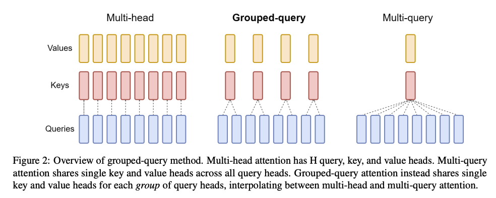
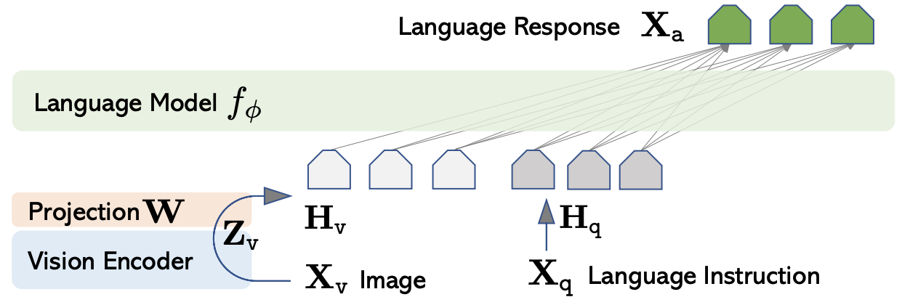

# 架构

GPT 系列模型的基础架构请参阅 [LLM Visualization](https://bbycroft.net/llm)。

### 位置嵌入

输入嵌入包括 token 嵌入和位置嵌入。这是因为自注意力机制（乃至整个 transformer）并不存在处理位置等信息的机制，token 的所有信息都必须写入到输入向量中。

位置嵌入考虑绝对位置和相对位置，但 token 的绝对位置并不重要——token 并不会因为它的绝对位置而被赋予什么含义；换个角度想，训练中一个 token、句子或段落出现在上下文窗口中的位置是随机的，绝对位置实际上没有什么意义。并且在越来越长的上下文窗口中，对于绝对位置的编码也难以形成差异。

[2104.09864](https://arxiv.org/abs/2104.09864) 提出的 RoPE（Rotary Position Embedding）采用了相对位置，并且在计算上简单高效。

RoPE 实质上就是，对查询向量 $\pmb q_m$ 和键向量 $\pmb k_m$ 的元素进行两两分组，每组视作一个二维向量，然后左乘矩阵

$$
\begin{bmatrix}
\cos m\theta & -\sin m\theta\\
\sin m\theta &  \cos m\theta
\end{bmatrix}
$$

即在实平面中逆时针旋转一个角度 $m\theta$。之后对 $\pmb q_m$ 和 $\pmb k_n$ 计算点积，可以视作相应组作点积再求和，因此对于相距越远的 $m$ 和 $n$，旋转角度差 $(m-n)\theta$ 越大，点积 $\pmb q_{m,[j]}\cdot\pmb k_{n,[j]}=\vert\pmb q_{m,[j]}\vert\vert\pmb k_{n,[j]}\vert\cos\alpha$ 因为夹角 $\alpha$ 变化而产生的变化越大，其中 $[j]$ 表示第 $j$ 组。

### 注意力头

* MHA（多头注意力）（多个 q、k、v 头）[[1706.03762](https://arxiv.org/abs/1706.03762)]
* MQA（多查询注意力）（多个 q 头，一个 k、v 头；大幅提升计算速度，但造成模型表现下降以及训练不稳定）[[1911.02150](https://arxiv.org/abs/1911.02150)]
* GQA（分组查询注意力）（每组多个 q 头，一个 k、v 头；计算速度接近 MQA，模型表现接近 MHA）（llama 3 采用）[[2305.13245](https://arxiv.org/abs/2305.13245)]

## 多模态

* LLaVA（首个开源 MLLM）[[2304.08485](https://arxiv.org/abs/2304.08485)]
    * 模型架构如下：

        
    
        其中 Vision Encoder 是预训练的 [CLIP ViT-L/14](https://huggingface.co/openai/clip-vit-large-patch14) 模型。
    * 模型训练分为两个阶段：
        1. 预训练以对齐特征。数据构造方法为，对于一个图像标题对 (image, caption)，从预先编写好的若干个描述图像的指令中抽取一个指令 instruction，`USER: [image][instruction]<STOP>Assistant: [caption]<STOP>` 即为一个样本。可训练参数为 $W$。
        1. 端到端地微调。数据构造方法为，对于一个图像 image，产生它的 5 个标题和对象检测结果作为上下文 context（如何产生？），使用 GPT-4 生成相应的 response，prompt 采用 `SYSTEM: [system message]<STOP>USER: [context1]<STOP>Assistant: [response1]<STOP>...USER: [context]<STOP>Assistant:`，其中 system message 有三种类型，(context1, response1) 等为 few-shot 的示例，详见 [prompts](https://github.com/haotian-liu/LLaVA/tree/main/playground/data/prompts)。可训练参数为 $W,\phi$。

* LLaVA 的改进[[2310.03744](https://arxiv.org/abs/2310.03744)]
    * 将线性投影改为两层 FFN，以提升多模态能力。
    * 增加数据集，以加强模型多方面的能力：
        * outside-knowledge VQA：结合外部知识。
        * OCR：识别图像中的文字。
        * region-level VQA：定位到细节。
    * 提高输入图像的分辨率（Vision Encoder 换用 [CLIP ViT-L/14-336px](https://huggingface.co/openai/clip-vit-large-patch14-336)），使得 LLM 能够看到更多细节。
    * 扩大 LLM 的规模。
    * 对于简短的回答，在相应的问题末尾附加“Answer the question using a single word or phrase”。这样微调出来的模型可以根据用户指令适当地调整输出格式（长短）。
* Mini-Gemini（）[[2403.18814](https://arxiv.org/abs/2403.18814)]

### 实现

## MOE

* MoE（）[[1701.06538](https://arxiv.org/abs/1701.06538)]

### 实现

## 新架构

* RWKV（）[[2305.13048](https://arxiv.org/abs/2305.13048)]
