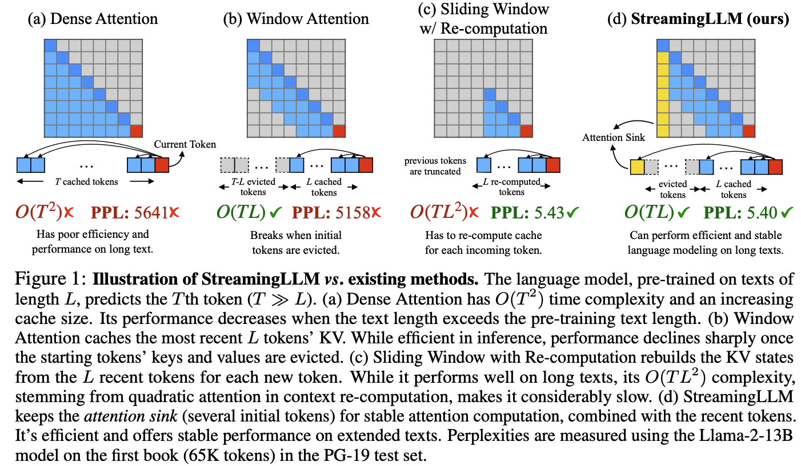
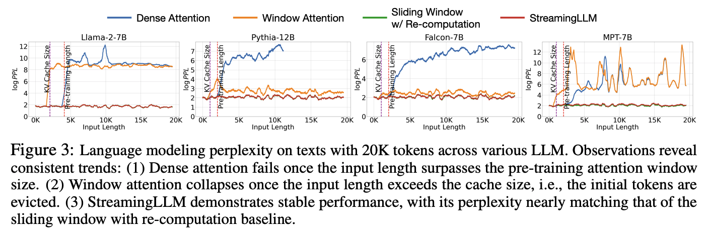
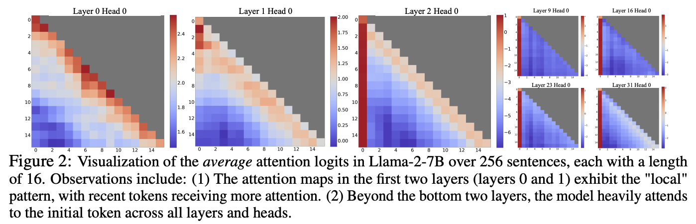

# 推理

这里以开源项目 OLMo 为例，介绍代码实现。

## 加速

* 量化（到 4-bit 量化）
* speculative decoding（预测接下来的几个 token，类似 CPU 的分支预测）[[2211.17192](https://arxiv.org/abs/2211.17192)]

    

    * 预言家可以是压缩过的 NAR 模型、搜索引擎等。
    * 可以引入多个预言家。

* KV cache

## 提升表现

* self-consistency（采样多个回答，选取最一致的回答）[[2203.11171](https://arxiv.org/abs/2203.11171)]
* LLM cascade（顺序调用从弱到强，同时也是成本从低到高的多个 LLM，当回答足够可靠时返回给用户，并取消后续调用）[[2305.05176](https://arxiv.org/abs/2305.05176)]

## 上下文长度

[2309.17453](https://arxiv.org/abs/2309.17453) 提出的 StreamingLLM 通过在计算注意力时固定包含前几个 token，提升了注意力计算的稳定性，使得 LLM 推理在超出预训练时的注意力窗口长度后依然{稳定}。

将 LLM 应用于无限长度的输入流（如图 1a）时，存在三个主要问题：

1. 需要 attend 的 token 过多，导致时延过长（逐渐增加）。
1. LLM 缓存所有 token 的 kv 状态，导致过多的内存使用。
1. 当序列长度超过预训练时的注意力窗口长度时表现下降。

窗口注意力方法 [[2004.05150](https://arxiv.org/abs/2004.05150)]（如图 1b）维护一个固定大小的滑动窗口，存储最近 n 个 token 的 kv 状态。尽管它可以保持恒定的内存使用和时延，但一旦序列长度超过窗口大小，即使只是驱逐第一个 token 的 kv，困惑度也会骤增。

另一种方法（作为基线）是每次重新计算滑动窗口内所有 token 的 kv 状态（如图 1c）。其提供良好的困惑度表现，但时延过长。

为了理解窗口注意力方法的失败原因，原论文进行了一些探索。简言之，对于高层的 transformer 块，其输入很可能已经包含足够的用于预测下一个 token 的信息，因而不再需要 attend，注意力分数以集中到初始 token 的形式被丢弃（相当于丢垃圾）。一旦初始 token 被驱逐出窗口，注意力分数的分布会发生显著变化，从而严重影响（每一层的）注意力乃至最终预测。

??? abstract "详细解释"

    图 3 显示了在 20k token 文本上进行语言建模时的困惑度。显而易见的是，当文本长度超过缓存大小时，困惑度会激增，这是由于排除了初始 token 导致的。这表明，无论初始 token 与预测 token 的距离如何，它们对于维持 LLM 的稳定性都是至关重要的。

    

    为什么在删除初始 token 的 kv 时 LLM 会出现问题呢？图 2 可视化了 Llama-2-7B 所有层和头的注意力图。我们发现，除了底部两层外，所有层和头的注意力都始终集中于初始 token。这意味着：删除这些初始 token 的 kv 将会删除 softmax 函数中分母的相当部分，导致注意力分数的分布发生显著变化，远离正常推理情形下的预期分布。

    

    为了解释为什么注意力过度集中于初始 token——无论其在语言建模中的语义相关性如何，我们引入了 **attention sink** 的概念。softmax 函数的性质防止了所有受到关注的 token 具有零值。这需要在所有层的所有头中聚合一些来自其他 token 的信息，即使当前的嵌入对其预测已经包含足够的信息。因此，模型倾向于将不必要的注意力分数给到特定的 token。

    由于自回归语言建模的顺序性质，初始 token 对所有后续 token 都是可见的，而后续 token 只对有限的一组后续 token 可见。因此，初始 token 更容易被训练为 attention sink，捕获不必要的注意力。我们已经注意到，LLM 通常被训练为利用多个初始 token 作为 attention sink，而不仅仅是一个。引入 4 个初始 token 作为 attention sink 足以恢复 LLM 的困惑度表现。

对于预训练过的 LLM，启用 streaming 只需要重新引入一些初始 token 的 kv 到注意力计算中，如图 1d 所示。StreamingLLM 的设计可以无缝集成到使用了相对位置编码（例如 RoPE 和 ALiBi）的 LLM 中。

StreamingLLM 采用缓存区中的相对位置而非原始文本中的相对位置，即 attention sink 和滑动窗口总是相邻的。因此对于像 RoPE 这样的编码，我们缓存引入旋转变换之前的 token 的 key。然后在每个解码阶段，我们对缓存区中的键应用旋转变换。

手动引入一个全局可训练的 attention sink token 是一个潜在的补救方案，它将作为不必要的注意力分数的存储仓库。实验显示，该方案在稳定注意力机制方面非常有效。基于此，我们建议在训练未来的 LLM 时在所有样本的起始位置都添加一个 sink token 以优化 streaming。
