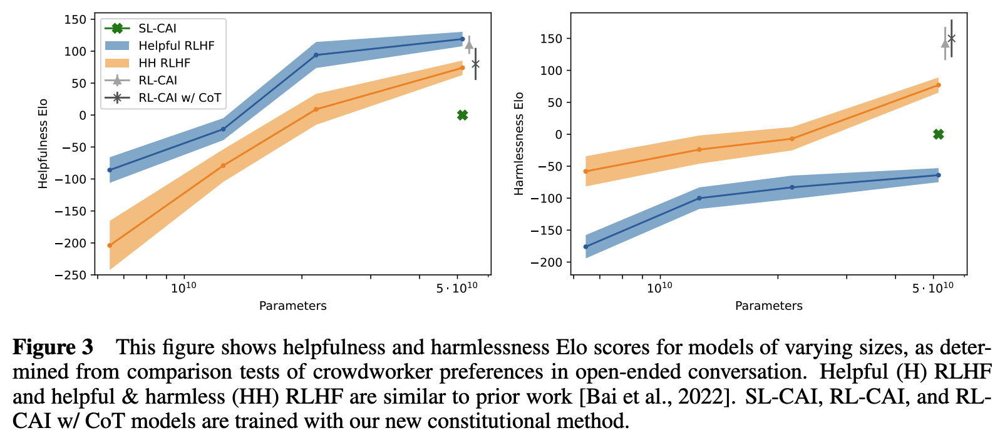
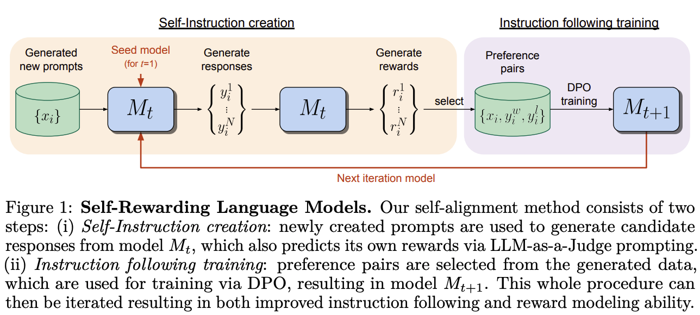

# 训练

## 预训练

### 实现

这里以开源项目 [OLMo](https://github.com/allenai/OLMo) 为例，介绍其预训练流程以及主要参数和指标。

参数：

* `seed`：随机种子，用于所有随机数模块（除打乱数据集）
* `precision`：训练/评估的计算精度，取 `fp32`、`amp_fp16` 或 `amp_bf16`
* `eval_interval`：评估间隔步数
* `save_interval`：保存间隔步数
* `save_folder`：保存目录，在这里保存训练配置、模型检查点
* 训练相关：
    * `max_duration`：训练总 epoch 数、步数或 token 数
    * `global_train_batch_size`：等效全局 batch size
    * `device_train_batch_size`：等效设备 batch size，等于 `global_train_batch_size // world_size`
    * `device_train_microbatch_size`：在一次前向反向计算中实际传给模型的 batch size，应根据可用显存将其设置得尽可能大
    * `device_train_grad_accum`：梯度累积次数，等于 `device_train_batch_size // device_train_microbatch_size`
    * `max_grad_norm`：最大梯度（l2）范数。范数大于设定值的梯度会被裁剪
* `model`（模型相关）：
    * `n_layers`：transformer 层数
    * `d_model`：隐状态维数
    * `mlp_hidden_size`：MLP 的隐状态维数
    * `n_heads`：自注意力头数
    * `n_kv_heads`：k、v 头数，若设为 `n_heads`，则为 MHA；若设为 1，则为 MQA；若设为 `n_heads` 的其他因数，则为 GQA
    * `include_bias`：所有线性层是否引入偏置
    * `layer_norm_with_affine`：层归一化是否引入权重和偏置参数
    * `rope`：是否应用 RoPE
    * `rope_full_precision`：是否在全精度下应用 RoPE
    * `attention_dropout`：对于缩放点积注意力的丢弃概率
    * `residual_dropout`：残差连接时对于 $f(x)$ 的丢弃概率
    * `vocab_size`：词汇表规模
    * `embedding_size`：嵌入表规模，设为大于 `vocab_size` 的 128 的倍数可以显著提升吞吐量（多余的 token 槽位被设为全 0 向量）
    * `embedding_dropout`：对于输入嵌入的丢弃概率
    * `max_sequence_length`：模型支持的最大输入长度
    * `activation_type`：激活函数类型
    * `weight_tying`：是否关联输入嵌入权重与输出线性层权重
    * `eos_token_id`：EOS token 的 ID
    * `pad_token_id`：填充 token 的 ID
    * `flash_attention`：是否使用 `FlashAttention` 加速注意力计算
    * `init_fn`：参数初始化策略，取 `normal`、`mitchell`、`kaiming_normal`、`fan_in` 或 `full_megatron`
* `optimizer`（优化器相关）：
    * `name`：优化器类型
    * `learning_rate`：学习率
    * `weight_decay`：权重衰减
    * `betas`：beta 值
    * `decay_norm_and_bias`：衰减所有偏置和层归一化权重
    * `decay_embedding`：衰减嵌入层权重
* `scheduler`（规划器相关）：
    * `name`：规划器类型
    * `t_warmup`：热身步数
* `evaluators`（评估相关）：
    * `label`：评估标签（名称）
    * `type`：评估类型，取 `lm` 或 `downstream`
    * `data`：评估数据，详见 `data`
* `data`（数据相关）：
    * `paths`：数据文件路径列表
    * `pad_direction`：填充方向
    * `seed`：随机种子，用于打乱数据集
    * `[num_workers|pin_memory|drop_last|timeout|persistant_workers|prefetch_factor]`：请参阅 [`torch.utils.data.DataLoader`](https://pytorch.org/docs/stable/data.html#torch.utils.data.DataLoader)

指标：

* `train/Perplexity`：困惑度。对交叉熵求 `exp()` 即为困惑度
* `train/CrossEntropyLoss`：交叉熵
* `optim/total_grad_norm`：若将所有参数的梯度拼接为一个向量，该向量的范数
* `optim/clipping_rate`：
* `throughput/device/tokens_per_second`：单个设备每秒处理的 token 数量
* `throughput/device/batches_per_second`：单个设备每秒处理的 batch 数量

流程：

1. 使用 torchrun 启动并行训练
    * 运行命令 `torchrun --nproc_per_node=8 scripts/train.py configs/official/OLMo-1B.yaml`
1. [scripts/train.py#L251] 初始化进程组
    * 使用 NCCL 作为分布式后端
    * 默认根据环境变量 `MASTER_PORT`、`MASTER_ADDR`、`WORLD_SIZE`、`RANK`（由 torchrun 设置）进行初始化
1. [scripts/train.py#L106] 设置随机种子
    * [olmo/torch_util.py#L19-L24] 为所有随机数模块设置随机种子
1. [scripts/train.py#L109] 构建 data loader
    * 数据集文件为多个 `.npy` 文件。`.npy` 是 NumPy 的一种二进制文件格式，用于存储 NumPy 数组数据，包括数组元素、维度和数据类型信息。
    * [olmo/data/memmap_dataset.py#L18] `MemMapDataset` 继承了抽象类 [`torch.utils.data.Dataset`](https://pytorch.org/docs/stable/data.html#torch.utils.data.Dataset)，其映射一个索引到一个字典 `{'input_ids': input_ids, ...}`，其中 `input_ids` 是读取自一个块的 NumPy 数组转换成的 PyTorch 张量。一个块是 `max_sequence_length * dtype_size` 个字节，作为一个训练样本。每个数据集文件被顺序划分为若干个块，末尾不足一个块的部分被丢弃。[olmo/data/__init__.py#L87] 构建一个这样的数据集。
    * [olmo/data/collator.py#L15] `DataCollator` 将训练样本（`{'input_ids': input_ids, ...}`）列表打包为批次，其先将每个训练样本的 `input_ids`（或其他张量）填充到所有训练样本的最大长度，再堆叠它们，最终仍然返回一个字典 `{'input_ids': batched_input_ids, ...}`。[olmo/data/__init__.py#L84] 构建一个这样的 data collator。
    * [olmo/data/iterable_dataset.py#L19] `IterableDataset` 继承了抽象类 [`torch.utils.data.IterableDataset`](https://pytorch.org/docs/stable/data.html#torch.utils.data.IterableDataset)，其将 `MemMapDataset` 实例进一步包装为可迭代的数据集，并实现以下功能：
        * 根据随机种子和当前 epoch 确定性地打乱全局索引（即 `MemMapDataset` 实例的所有样本的索引），并保存为 `.npy` 文件以便于当前 epoch 重启训练。
        * 根据当前 rank 取全局索引的子集，所有 rank 的子集是对全局索引的一个划分（partition）。相当于 [`torch.utils.data.distributed.DistributedSampler`](https://pytorch.org/docs/stable/data.html#torch.utils.data.distributed.DistributedSampler) 的作用。
        * 根据当前 data loader worker ID 取 rank 索引的子集，所有 data loader worker 的子集是对 rank 索引的一个划分。
        * [olmo/data/__init__.py#L99] 进行包装。
1. [scripts/train.py#L112] 构建 evaluator
    * [olmo/eval/evaluator.py#L15] `Evaluator` 维护和计算指标，有两种类型：lm 和 downstream
    * [olmo/eval/__init__.py#L79] 对于 lm 类型，[olmo/data/__init__.py#L47] 构建 data loader 的步骤类似于 4.，但没有经过 `IterableDataset` 包装而是直接使用 `torch.utils.data.distributed.DistributedSampler`，因而更加简单；[olmo/eval/evaluator.py#L75] 指标为困惑度和交叉熵。
    * [olmo/eval/__init__.py#L76] 对于 downstream 类型，[olmo/data/__init__.py#L24] 数据集和指标都是针对具体任务单独实现。例如对于基准测试 PIQA（常识问答，多项选择），数据集的实现使用 `datasets` 库加载原数据集，对每个样本的问题和答案选项进行分词，连同 target 作为新的样本；指标选用 acc。
1. [scripts/train.py#L117] 构建模型
    * 包含以下层：
        * [olmo/model.py#L960] `wte`：嵌入层
        * [olmo/model.py#L963] `emb_drop`：嵌入丢弃层
        * [olmo/model.py#L968] transformer 块
            * [olmo/model.py#L460] `rotary_emb`：旋转嵌入层，请参阅[位置嵌入](./architecture.md#位置嵌入)。[olmo/model.py#L253] `RotaryEmbedding` 手动实现了 RoPE
            * [olmo/model.py#L642] `attn_norm`：self-attention 之前的层归一化层
            * [olmo/model.py#L652] `att_proj`：计算 q、k、v 的线性层
            * [olmo/model.py#L445] `att_out`：对计算得到的注意力进行线性变换的线性层
            * [olmo/model.py#L643] `ff_norm`：FFN 之前的层归一化层
            * [olmo/model.py#L656] `ff_proj`：两层 FFN 的第一层
            * [olmo/model.py#L441] `act`：激活函数层
            * [olmo/model.py#L450] `ff_out`：两层 FFN 的第二层
            * [olmo/model.py#L422] `dropout`：残差连接时的丢弃层
        * [olmo/model.py#L964] `ln_f`：计算 logits 之前的层归一化层
        * [olmo/model.py#L985] `ff_out`（可选，可以共用 `wte`）：logits 输出层
    * 前向计算步骤如下：
        ```python
        # 现有 input_ids, attention_mask, attention_bias

        # 嵌入
        # input_ids: (batch_size, seq_len)
        # x: (batch_size, seq_len, d_model)
        batch_size, seq_len = input_ids.size()
        x = self.emb_drop(self.wte(input_ids))

        # 构建 attention mask
        # 这里的 attention_mask 对应 transformers 库的 attention mask，参阅 https://huggingface.co/docs/transformers/en/glossary#attention-mask
        #       attention_bias 对应 `F.scaled_dot_product_attention` 的 attn_mask
        # attention_mask: (batch_size, seq_len) -> (batch_size, 1, 1, seq_len)
        # attention_bias: (1, 1, seq_len, seq_len)
        attention_mask = attention_mask.to(dtype=torch.float).view(batch_size, -1)[:, None, None, :]
        attention_mask = (1.0 - attention_mask) * torch.finfo(attention_mask.dtype).min  # e.g. [0, 1, 1, 1] -> [dtype.min, 0, 0, 0]
        attention_bias = attention_bias + attention_mask  # e.g. [[0, dtype.min, dtype.min, dtype.min]    [[dtype.min, dtype.min, dtype.min, dtype.min]
                                                            #       [0,         0, dtype.min, dtype.min] ->  [dtype.min,         0, dtype.min, dtype.min]
                                                            #       [0,         0,         0, dtype.min]     [dtype.min,         0,         0, dtype.min]
                                                            #       [0,         0,         0,         0]]    [dtype.min,         0,         0,         0]]
        # `F.scaled_dot_product_attention()` 不能正确地处理 -inf，这里用 dtype.min 替代

        # for transformer blocks
        # 计算 q, k, v
        # x: (batch_size, seq_len, d_model)
        # qkv: (batch_size, seq_len, d_model + 2 * n_kv_heads * head_dim)
        qkv = self.att_proj(self.attn_norm(x))
        # self.attn_norm(x) 类似于 F.layer_norm(x, [d_model])

        # 拆分 q, k, v
        # q: (batch_size, seq_len, d_model), (B, T, C)
        # k, v: (batch_size, seq_len, n_kv_heads * head_dim), (B, T, n_kv_h * hd)
        q, k, v = qkv.split(self.fused_dims, dim=-1)

        # 拆分头数的维度，并移动到轴 1
        # q: (B, T, C) -> (B, nh, T, hd)
        # k, v: (B, T, n_kv_h * hd) -> (B, n_kv_h, T, hd)
        q = q.view(B, T, n_heads, C // n_heads).transpose(1, 2)
        k = k.view(B, T, n_kv_heads, C // n_heads).transpose(1, 2)
        v = v.view(B, T, n_kv_heads, C // n_heads).transpose(1, 2)

        # 对 q, k 应用 RoPE，详见 [olmo/model.py#L300]
        q, k = self.rotary_emb(q, k)

        # 计算缩放点积注意力 - 实现 1：flash attention 实现，无 attention mask
        att = flash_attn_func(
                q.transpose(1, 2), k.transpose(1, 2), v.transpose(1, 2), dropout_p=attention_dropout, causal=True
        ).transpose(1, 2)
        # 计算缩放点积注意力 - 实现 2：torch 实现，有 attention mask
        num_kv_heads = k.size(1)
        num_q_heads = q.size(1)
        if num_q_heads != num_kv_heads:
            k = k.repeat_interleave(num_q_heads // num_kv_heads, dim=1, output_size=num_q_heads)
            v = v.repeat_interleave(num_q_heads // num_kv_heads, dim=1, output_size=num_q_heads)
        F.scaled_dot_product_attention(q, k, v, attn_mask=attention_bias, dropout_p=attention_dropout, is_causal=False)
        # 计算缩放点积注意力的具体实现可以参阅 nanogpt: https://github.com/karpathy/nanoGPT/blob/master/model.py#L67-L71
        # att = (q @ k.transpose(-2, -1)) * (1.0 / math.sqrt(k.size(-1)))    # (B, nh, T, hd) @ (B, nh, hd, T) -> (B, nh, T, T)
        # tril = torch.tril(torch.ones(max_sequence_length, max_sequence_length))
        # att = att.masked_fill(tril[:,:,:T,:T] == 0, float('-inf'))
        # att = F.softmax(att, dim=-1)
        # att = att @ v    # (B, nh, T, T) @ (B, nh, T, hd) -> (B, nh, T, hd)

        # 重新拼接所有头的注意力
        att = att.transpose(1, 2).contiguous().view(B, T, C)  

        # 线性变换后输出
        att = self.attn_out(att)

        # 残差连接，可选地丢弃注意力
        x = x + self.dropout(att)

        # 计算 FFN
        # x: (batch_size, seq_len, d_model)
        x0 = x
        x = self.ff_out(self.act(self.ff_proj(self.ff_norm(x))))
        # self.ff_norm(x) 类似于 F.layer_norm(x, [d_model])
        # self.ff_proj() 是两层 FFN 的第一层
        # self.act() 是两层 FFN 的中间的激活函数。若为 swiglu 类型，则 W_1 被视为 [W V]
        # self.ff_out() 是两层 FFN 的第二层

        # 残差连接
        x = x0 + self.dropout(x)
        # end for transformer blocks

        # 计算 logits
        # x: (batch_size, seq_len, d_model)
        # logits: (batch_size, seq_len, embedding_size)
        x = self.ln_f(x)
        logits = F.linear(x, self.transformer.wte.weight, None)  # 关联权重
        logits = self.transformer.ff_out(x)  # 不关联权重

        # 计算损失
        # logits_for_loss: (batch_size, seq_len - 1, embedding_size) -> (batch_size * (seq_len - 1), embedding_size)
        # labels: (batch_size, seq_len - 1)
        logits_for_loss = logits[..., :-1, :].contiguous()  # 去掉序列末位的 logits，因为没有相应的 label
        logits_for_loss = logits_for_loss.view(-1, logits_for_loss.size(-1))
        labels = input_ids.clone()[..., 1:].contiguous()    # 去掉序列首位的 token，因为没有相应的 logits
        ce_loss = F.cross_entropy(logits_for_loss, labels, ignore_index=-100)
        ```
    * 与 [nanogpt](https://github.com/karpathy/nanoGPT)（[可视化](https://bbycroft.net/llm)）的区别在于：
        * OLMo 采用 RoPE，而 nanogpt 采用绝对位置编码
        * OLMo 考虑到因为 left padding attention mask 不为三角矩阵的情况（虽然在实际训练中这种情况并没有出现）
        * nanogpt 没有丢弃层
1. [scripts/train.py#L136] 使用 FSDP（ZeRO-3）包装模型（这里不再展开）
1. [scripts/train.py#L155-156] 构建优化器和 lr 规划器
    * [olmo/optim.py#L622] 所有线性层的 `weight` 进行权重衰减，其余参数不进行权重衰减
    * lr 在热身阶段逐渐上升，在热身阶段之后逐渐下降直至收敛（热身以削弱首因效应，参阅 [What does learning rate warm-up mean?](https://stackoverflow.com/questions/55933867/what-does-learning-rate-warm-up-mean)）
    * 最大梯度范数（max grad norm）在热身阶段取较大值，在热身阶段之后取较小值（热身阶段容许训练不稳定）
1. [scripts/train.py#L168,238] 构建 Trainer，开始训练
    * 记录各指标
    * 定期评估（TODO）、保存检查点
    * batch 分成 micro-batch，进行梯度累积
    * 裁剪梯度
    * 使用 PyTorch Profiler 进行 profiling

一些优化措施：

* 保存当前 epoch 的数据索引文件

### trick


## 微调

对于微调的数据，质量比数量更重要，换言之，在精不在多。

### SFT（有监督微调）

数据来自：选取具有代表性的问题，人类编写答案。

#### 实现

### RLHF

[2203.02155](https://arxiv.org/abs/2203.02155)

先训练反映人类偏好的奖励模型，再将其作为环境使用 PPO 算法训练 LLM。


数据来自：选取具有代表性的问题，LLM 生成两个（或多个）答案，人类对这些答案进行排序。

比较 SFT 和 RLHF：

* 从人类产生训练数据的角度看，人类写出高质量的答案并不容易（甚至写不出来），成本也高；但人类比较答案的相对好坏则容易得多，成本也低得多。
* 从模型学习的角度来看，在 SFT 中，模型学习的是接下一个 token，对于答案整体没有考量；在 RLHF 中，模型学习的是对于答案整体的选择（强化学习的思路）。

RLHF 的问题和局限性（[2307.15217](https://arxiv.org/abs/2307.15217)）：

* 

#### 流程

TODO

#### 实现

TODO

### 新的 RL 算法

* DPO（）[[2305.18290](https://arxiv.org/abs/2305.18290)]
* SPIN（）[[2401.01335](https://arxiv.org/abs/2401.01335)]

#### 流程

#### 实现

### RLAIF

!!! note "注意"
    在这一部分的表述中，“指令”指 SFT 样本或 RL 样本中的 prompt 部分，“prompt”专指为了让 LLM 生成数据而构建的 prompt。

* self-instruct（LLM SFT 自己）[[2212.10560](https://arxiv.org/abs/2212.10560)]
    * SFT（注：原论文为“指令微调”）需要的人类编写的数据受限于数量（成本高）、多样性和创造性，self-instruct 方法使用 LLM 生成指令和回答以 SFT 这个 LLM 自身。
    * 生成指令和回答的 prompt 均采用 few-shot，需要准备一些任务示例。
    * self-instruct 方法应用于 vanilla GPT-3 ，得到的模型表现接近 text-davinci-001。
    * Alpaca（使用 GPT-3.5 生成的数据 SFT LLaMA）[[tatsu-lab/stanford_alpaca](https://github.com/tatsu-lab/stanford_alpaca)]
    * Vicuna（使用 ChatGPT 生成的数据 SFT LLaMA，对话来自用户分享）[[lm-sys/FastChat](https://github.com/lm-sys/FastChat)]
    * LLaMA-GPT4（使用 GPT-4 生成的数据 SFT LLaMA，指令来自 Alpaca；另外使用 GPT-4 生成的数据训练反映 GPT-4 偏好的奖励模型）[[2304.03277](https://arxiv.org/abs/2304.03277)]
* Constitutional AI（CAI，宪法 AI）[[2212.08073](https://arxiv.org/abs/2212.08073)]
    * 理念：
        * 利用 AI 来更有效地监督 AI，人类只需要制定一些原则（宏大愿景）
        * RLHF 需要大量人类标注的数据，这些数据的成本高，并且人类无法有效地理解或总结这些数据。将 RL 目标编码为自然语言表述的原则的列表，并让 LLM 根据原则解释为何拒绝有害请求，会是更好的方案。
        * 在无害程度相当的条件下，偏好更加积极、透明、解释性的回答，而不是回避性质的回答，例如”我不能回答这个问题“。因为出于安全方面的考虑，让 LLM 的思维过程保持透明十分重要；出于实践方面的考虑，正面回应的回答的有用性也更好。
    * 方法：
        1. 向一个 helpful RLHF 模型（经过 RLHF 训练，且训练数据仅包括有用性比较）（称为模型 A）展示一个被设计引导有害行为的指令，采样一个回答。然后要求模型 A 批评并修改该回答，重复数次，其中每次要求批评和要求修改的 prompt 是一对，从预先编写好的若干对（称为原则）中随机抽取，这些原则可以分别强调不同面向的有害性，它们和 4. 中的原则共同构成了宪法。每次修改后的回答都和当前指令拼接为一个 SFT 样本，准备许多这样的指令以收集数据。
        1. 准备一些 helpfulness 指令（用于评估回答有用性的指令），采样模型 A 的回答，与当前指令拼接为一个 SFT 样本。
        1. 使用 1. 和 2. 收集的数据 SFT 一个预训练模型（称为模型 B），得到的模型称为 SL-CAI。
        1. 向 SL-CAI 展示一个指令，采样一对回答。然后将该指令和回答对展示给一个 feedback 模型（称为模型 C），并附加一个原则，要求模型 C 选择更好的回答。同样地，原则也是从预先编写好的若干个中随机抽取。计算两个回答的概率，作为 soft label（相比 hard label，训练出来的模型产生的回答更加健壮）和当前指令以及回答对拼接为一个 RL 样本，准备许多这样的指令以收集数据。要求选择回答的 prompt 可以选用 CoT。
        1. 准备一些人类标注的有用性比较样本。
        1. 使用 5. 和 6. 收集的数据 RL 训练 SL-CAI，得到的模型称为 RL-CAI。
    * 结果：
        
        

        以及，RL-CAI 几乎不会回避问题，而是给出透明并且无害的回答。

* RLAIF（完善 RLAIF 方法）[[2309.00267](https://arxiv.org/abs/2309.00267)]
    * LLM 标注偏好：向一个 labeler 模型（称为模型 A）展示一个指令和回答对，要求模型 A 选择更好的回答，计算两个回答的概率，作为 soft label 和当前指令以及回答对拼接为一个 RL 样本。
        * 指令和回答对来自已有的数据集。
        * 要求选择回答的 prompt 可以选用 few-shot 和 CoT。
        * 交换两个回答的位置计算两次取平均，以消除位置偏差。
        * 模型 A 可以是一个预训练模型或 SFT 过的模型。
    * RLAIF：
        * distilled RLAIF：使用收集的数据训练一个奖励模型（称为模型 B）。具体地，将模型 B 生成的分数作 softmax，计算得到的概率分布与 soft label 的交叉熵。模型 B 学习的是模型 A 的偏好，这可以视作是一种模型蒸馏。
        * direct RLAIF：向一个 LLM（称为模型 C）展示一个指令和一个回答，以及具体的评分标准，要求模型 C 进行评分，计算 10 个分数（从 1 到 10）的概率，计算加权分数，再归一化到 [0,1] 区间以作为奖励。
            * 要求进行评分的 prompt 可以选用 few-shot 和 CoT。
            * 模型 C 可以是一个预训练模型或 SFT 过的模型。
    * 结果：
        * RLAIF 实现与 RLHF 相当或更好的模型表现。
        * 即使 labeler 模型的大小与 policy（在 RLAIF 之前是一个 SFT 过的模型）相同，RLAIF 依然可以提升 policy 的表现。
        * direct RLAIF 实现比 distilled RLAIF 更好的模型表现。
        * 对于不同的任务，prompt 的最优配置也不同。
* self-rewarding（LLM 奖励自己）[[2401.10020](https://arxiv.org/abs/2401.10020)]
    * 方法：
        1. 准备一些人类标注的指令遵循样本（称为 IFT 数据）和 LLM-as-a-Judge 指令遵循样本（prompt 包括指令、回答、评分标准，采用 CoT，要求 LLM 进行评分，称为 EFT 数据），SFT 一个预训练模型（称为 M0），得到的模型称为 M1。
        1. 使用模型 M1 生成 RL 样本，重复下列步骤以收集数据：
            1. 生成一个新的指令，prompt 采用 few-shot（来自 IFT）。
            1. 采样 N 个候选回答。
            1. 使用 LLM-as-a-Judge prompt 评估候选回答，从 0 到 5 打分，取最高分和最低分回答组成回答对。若最高分和最低分相同，则跳过当前循环。回答对与指令拼接为一个 RL 样本。
        1. 使用 2. 收集的数据 RL（DPO）训练 M1，得到的模型称为 M2。
        1. 重复 2. 和 3.，训练 M2，得到的模型称为 M3。

        

    * 结果：
        * SFT 阶段 EFT 数据的加入提升 LLM 作为奖励模型的评估能力，而几乎不影响 LLM 的指令遵循能力。
        * 对于指令遵循能力，M1 < M2 < M3。M3 在 AlpacaEval 2.0（评估指令遵循能力）排行榜上超过了 Claude 2、Gemini Pro 和 GPT4 0613。
        * 对于作为奖励模型的评估能力，M1 < M2 < M3。
        * 对于在下游任务上的表现，对于大部分 NLP benchmark，M1 > M2 > M3，[2203.02155](https://arxiv.org/abs/2203.02155) 将这种现象称为对齐税（alignment tax）。

### PEFT

PEFT（Parameter-Efficient Fine-Tuning，参数高效微调）方法仅微调少量模型参数，显著降低计算和存储成本，却能够实现与全参数微调相当的模型表现。

PEFT 方法可以粗略分为以下三大类：

* additive：原始参数保持冻结，增加新的模块/参数进行微调
    * adapters（引入 adapter 模块）
    * soft prompts（引入虚拟 token）
* selective：仅更新原始参数的一部分，其他参数保持冻结
* reparameterization：不直接更新原始参数（的一部分），而是用一个更小的参数矩阵来表示原始参数的变化


* Adapter tuning（训练串联的 adapter 模块）[[1902.00751](https://arxiv.org/abs/1902.00751)]


* Prefix-Tuning（训练虚拟 token 前缀）[[2101.00190](https://arxiv.org/abs/2101.00190)]
    * 前缀就是若干个连续的、可训练的嵌入向量，放在输入序列之前，为接下来的生成提供某种上下文。
    * 前缀长度最小可取 1；前缀越长，可训练参数越多，表达能力越强，与此同时需要的注意力计算量越大，从而降低训练和推理速度。
    * 每个注意力层有自己单独的前缀。
    * 每种任务可训练一套前缀。


* P-tuning（）[[]()]

* LoRA（训练并联的秩分解矩阵）[[2106.09685](https://arxiv.org/abs/2106.09685)]
    * 秩分解矩阵就是令权重更新矩阵 $ΔW=BA$，其中 $W\in\mathbb{R}^{m×n},B\in\mathbb{R}^{m×r},A\in\mathbb{R}^{r×n},r<<\min(m,n)$。
    * 原则上，可为任何权重矩阵应用 LoRA；实践中，通常为 $W_q$ 和 $W_v$ 应用 LoRA。
    * LoRA 对于小数据量的微调也十分有效。
    * （对于预训练模型）较为简单的下游任务对应较小的最优秩 $r$ ，这意味着相应的 $ΔW$ 有较小的本征秩（intrinsic rank）；反之亦然。
    * 秩分解矩阵潜在地放大对于特定下游任务重要的、在通用预训练模型中已学到但并未被强调的特征。


* BitFit（仅更新偏置参数）[[2106.10199](https://arxiv.org/abs/2106.10199)]

* QLoRA（）[[]()]

#### 实现

##### Adapter tuning


##### Prefix-Tuning

```python 
def forward(
    self,
    input_ids=None,
    attention_mask=None,
    inputs_embeds=None,
    labels=None,
    output_attentions=None,
    output_hidden_states=None,
    return_dict=None,
    task_ids=None,
    **kwargs,
):
    peft_config = self.active_peft_config

    # 非 soft prompts 类型方法
    if not peft_config.is_prompt_learning:
        ...

    # soft prompts 类型方法
    batch_size = _get_batch_size(input_ids, inputs_embeds)
    if attention_mask is not None:
        # 拼接 prompt attention mask
        prefix_attention_mask = torch.ones(batch_size, peft_config.num_virtual_tokens).to(attention_mask.device)
        attention_mask = torch.cat((prefix_attention_mask, attention_mask), dim=1)

    ...
    kwargs.update(
        {
            "attention_mask": attention_mask,
            "labels": labels,
            "output_attentions": output_attentions,
            "output_hidden_states": output_hidden_states,
            "return_dict": return_dict,
        }
    )

    if peft_config.peft_type == PeftType.PREFIX_TUNING:
        # 生成 past_key_values 格式的 prompt
        kwargs["past_key_values"] = self.get_prompt(batch_size)
        # 调用基础模型的前向计算
        return self.base_model(input_ids=input_ids, inputs_embeds=inputs_embeds, **kwargs)
```

进一步查看如何生成 prompt：

```python
def get_prompt(self, batch_size: int, task_ids: Optional[torch.Tensor] = None) -> torch.Tensor:
    peft_config = self.active_peft_config
    # 获取 prefix encoder
    prompt_encoder = self.prompt_encoder[self.active_adapter]
    # 获取虚拟 token 索引，e.g. [0, 1, 2, 3]
    prompt_tokens = (
        self.prompt_tokens[self.active_adapter]
        .unsqueeze(0)
        .expand(batch_size, -1)
        .to(prompt_encoder.embedding.weight.device)
    )
    if peft_config.peft_type == PeftType.PREFIX_TUNING:
        prompt_tokens = prompt_tokens[:, : peft_config.num_virtual_tokens]
        if peft_config.inference_mode:
            # 在推理模式下，直接重复虚拟 token 前缀
            past_key_values = prompt_encoder.embedding.weight.repeat(batch_size, 1, 1)
        else:
            # 在训练模式下，使用 prefix encoder 生成虚拟 token 前缀
            past_key_values = prompt_encoder(prompt_tokens)
        if self.base_model_torch_dtype is not None:
            past_key_values = past_key_values.to(self.base_model_torch_dtype)
        past_key_values = past_key_values.view(
            batch_size,
            peft_config.num_virtual_tokens,
            peft_config.num_layers * 2,
            peft_config.num_attention_heads,
            peft_config.token_dim // peft_config.num_attention_heads,
        )
        if peft_config.num_transformer_submodules == 2:
            past_key_values = torch.cat([past_key_values, past_key_values], dim=2)
        past_key_values = past_key_values.permute([2, 0, 3, 1, 4]).split(
            peft_config.num_transformer_submodules * 2
        )
        if TRANSFORMERS_MODELS_TO_PREFIX_TUNING_POSTPROCESS_MAPPING.get(self.config.model_type, None) is not None:
            post_process_fn = TRANSFORMERS_MODELS_TO_PREFIX_TUNING_POSTPROCESS_MAPPING[self.config.model_type]
            past_key_values = post_process_fn(past_key_values)
        return past_key_values
    else:
        ...
```

进一步查看 prefix encoder 的实现：

```python
class PrefixEncoder(torch.nn.Module):
    def __init__(self, config):
        super().__init__()
        # 是否启用投影
        self.prefix_projection = config.prefix_projection
        # 虚拟 token 嵌入维数
        token_dim = config.token_dim
        # 层数
        num_layers = config.num_layers
        # 编码器隐藏维数
        encoder_hidden_size = config.encoder_hidden_size
        # 虚拟 token 数量
        num_virtual_tokens = config.num_virtual_tokens

        if self.prefix_projection and not config.inference_mode:
            # 嵌入虚拟 token
            self.embedding = torch.nn.Embedding(num_virtual_tokens, token_dim)
            # 通过两层 MLP 变换
            self.transform = torch.nn.Sequential(
                torch.nn.Linear(token_dim, encoder_hidden_size),
                torch.nn.Tanh(),
                torch.nn.Linear(encoder_hidden_size, num_layers * 2 * token_dim),
            )
        else:
            # 直接嵌入虚拟 token 到所有层
            self.embedding = torch.nn.Embedding(num_virtual_tokens, num_layers * 2 * token_dim)

    def forward(self, prefix: torch.Tensor):
        if self.prefix_projection:
            # 先嵌入后变换
            prefix_tokens = self.embedding(prefix)
            past_key_values = self.transform(prefix_tokens)
        else:
            # 直接嵌入
            past_key_values = self.embedding(prefix)
        return past_key_values
```

**P-tuning**


**LoRA**

以 peft 库为例，其 LoRA 微调的实现可以参阅[代码实现](https://zhuanlan.zhihu.com/p/650197598)。

**BitFit**

```python
# 加载预训练模型
model = AutoModelForCausalLM.from_pretrained(model_path, low_cpu_mem_usage=True)

# 计算模型的总参数量
print(sum(param.numel() for param in model.parameters()))

# BitFit微调 - 只训练bias参数
num_param = 0
for name, param in model.named_parameters():
    if "bias" not in name:
        param.requires_grad = False  # 非bias参数冻结
    else:
        num_param += param.numel()  # 统计bias参数数量

# 打印bias参数数量
print(num_param)
# 打印bias参数占总参数的比例
print(num_param / sum(param.numel() for param in model.parameters()))
```

**QLoRA**
