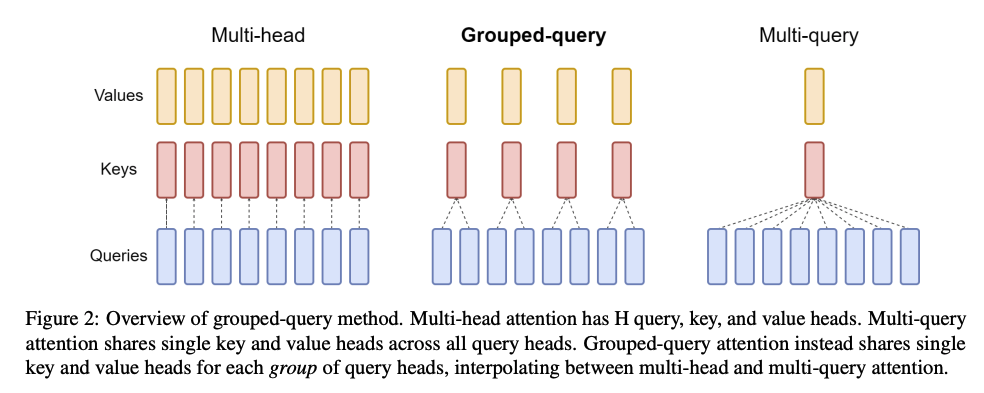

# 训练

## 预训练

这里以开源项目 OLMo 为例，介绍代码实现和主要参数

参数：

* `seed`：随机种子，用于所有随机数模块（除打乱数据集）
* `precision`：训练/评估的计算精度，取 `fp32`、`amp_fp16` 或 `amp_bf16`
* `eval_interval`：评估间隔步数
* `save_interval`：保存间隔步数
* 训练相关：
    * `max_duration`：训练总 epoch 数、步数或 token 数
    * `global_train_batch_size`：等效全局 batch size
    * `device_train_batch_size`：等效设备 batch size，等于 `global_train_batch_size // world_size`
    * `device_train_microbatch_size`：在一次前向反向计算中实际传给模型的 batch size，应根据可用显存将其设置得尽可能大
    * `device_train_grad_accum`：梯度累积次数，等于 `device_train_batch_size // device_train_microbatch_size`
    * `max_grad_norm`：最大梯度（l2）范数。范数大于设定值的梯度会被裁剪
* `model`（模型相关）：
    * `n_layers`：transformer 层数
    * `d_model`：隐状态维数
    * `mlp_hidden_size`：MLP 的隐状态维数
    * `n_heads`：自注意力头数
    * `n_kv_heads`：k、v 头数，若设为 `n_heads`，则为 MHA；若设为 1，则为 MQA；若设为 `n_heads` 的其他因数，则为 GQA
    * `include_bias`：线性层是否引入偏置
    * `layer_norm_with_affine`：层归一化是否引入权重和偏置参数
    * `rope`：是否应用 RoPE
    * `rope_full_precision`：是否在全精度下应用 RoPE
    * `attention_dropout`：对于缩放点积注意力的丢弃概率
    * `residual_dropout`：残差连接时对于 $f(x)$ 的丢弃概率
    * `vocab_size`：词汇表规模
    * `embedding_size`：嵌入表规模，设为大于 `vocab_size` 的 128 的倍数可以显著提升吞吐量（多余的 token 槽位被设为全 0 向量）
    * `embedding_dropout`：对于输入嵌入的丢弃概率
    * `max_sequence_length`：模型支持的最大输入长度
    * `activation_type`：激活函数类型
    * `weight_tying`：是否关联输入嵌入权重与输出线性层权重
    * `eos_token_id`：EOS token 的 ID
    * `pad_token_id`：填充 token 的 ID
    * `flash_attention`：是否使用 `FlashAttention` 加速注意力计算
    * `init_fn`：参数初始化策略，取 ``
    * `init_std`：
* `optimizer`（优化器相关）：
    * `name`：优化器类型
    * `learning_rate`：学习率
    * `weight_decay`：权重衰减
    * `betas`：beta 值
* `scheduler`（规划器相关）：
    * `name`：规划器类型
    * `t_warmup`：热身步数
* `evaluators`（评估相关）：
    * `label`：评估标签（名称）
    * `type`：评估类型，取 `lm` 或 `downstream`
    * `data`：评估数据，详见 `data`
* `data`（数据相关）：
    * `paths`：数据文件路径列表
    * `pad_direction`：填充方向
    * `seed`：随机种子，用于打乱数据集
    * `[num_workers|pin_memory|drop_last|timeout|persistant_workers|prefetch_factor]`：请参阅 [`torch.utils.data.DataLoader`](https://pytorch.org/docs/stable/data.html#torch.utils.data.DataLoader)

指标：

* `train/Perplexity`：困惑度。对交叉熵求 `exp()` 即为困惑度
* `train/CrossEntropyLoss`：交叉熵
* `optim/total_grad_norm`：若将所有参数的梯度拼接为一个向量，该向量的范数
* `optim/clipping_rate`：
* `throughput/device/tokens_per_second`：单个设备每秒处理的 token 数量
* `throughput/device/batches_per_second`：单个设备每秒处理的 batch 数量

流程：

1. 使用 torchrun 启动并行训练
    * 运行命令 `torchrun --nproc_per_node=8 scripts/train.py configs/official/OLMo-1B.yaml`
1. [scripts/train.py#L251] 初始化进程组
    * 使用 NCCL 作为分布式后端
    * 默认根据环境变量 `MASTER_PORT`、`MASTER_ADDR`、`WORLD_SIZE`、`RANK` 进行初始化
1. [scripts/train.py#L106] 设置随机种子
    * [olmo/torch_util.py#L19-L24] 为所有随机数模块设置随机种子
1. [scripts/train.py#L109] 构建 data loader
    * 数据集文件为多个 `.npy` 文件。`.npy` 是 NumPy 的一种二进制文件格式，用于存储 NumPy 数组数据，包括数组元素、维度和数据类型信息。
    * [olmo/data/memmap_dataset.py#L18] `MemMapDataset` 继承了抽象类 [`torch.utils.data.Dataset`](https://pytorch.org/docs/stable/data.html#torch.utils.data.Dataset)，其映射一个索引到一个字典 `{'input_ids': input_ids, ...}`，其中 `input_ids` 是读取自一个块的 NumPy 数组转换成的 PyTorch 张量。一个块是 `max_sequence_length * dtype_size` 个字节，作为一个训练样本。每个数据集文件被顺序划分为若干个块，末尾不足一个块的部分被丢弃。[olmo/data/__init__.py#L87] 构建一个这样的数据集。
    * [olmo/data/collator.py#L15] `DataCollator` 将训练样本（`{'input_ids': input_ids, ...}`）列表打包为批次，其先将每个训练样本的 `input_ids`（或其他张量）填充到所有训练样本的最大长度，再堆叠它们，最终仍然返回一个字典 `{'input_ids': batched_input_ids, ...}`。[olmo/data/__init__.py#L84] 构建一个这样的 data collator。
    * [olmo/data/iterable_dataset.py#L19] `IterableDataset` 继承了抽象类 [`torch.utils.data.IterableDataset`](https://pytorch.org/docs/stable/data.html#torch.utils.data.IterableDataset)，其将 `MemMapDataset` 实例进一步包装为可迭代的数据集，并实现以下功能：
        * 根据随机种子和当前 epoch 确定性地打乱全局索引（即 `MemMapDataset` 实例的所有样本的索引），并保存为 `.npy` 文件以便于重启训练。
        * 根据当前 rank 取全局索引的子集，所有 rank 的子集是对全局索引的一个划分。相当于 [`torch.utils.data.distributed.DistributedSampler`](https://pytorch.org/docs/stable/data.html#torch.utils.data.distributed.DistributedSampler) 的作用。
        * 根据当前 data loader worker ID 取 rank 索引的子集，所有 data loader worker 的子集是对 rank 索引的一个划分。
        * [olmo/data/__init__.py#L99] 进行包装。
1. [scripts/train.py#L112] 构建 evaluator
    * [olmo/eval/evaluator.py#L15] `Evaluator` 维护和计算指标，有两种类型：lm 和 downstream
    * [olmo/eval/__init__.py#L79] 对于 lm 类型，[olmo/data/__init__.py#L47] 构建 data loader 的步骤类似于 4.，但没有经过 `IterableDataset` 包装而是直接使用 `torch.utils.data.distributed.DistributedSampler`，因而更加简单；[olmo/eval/evaluator.py#L75] 指标为交叉熵（和困惑度）。
    * [olmo/eval/__init__.py#L76] 对于 downstream 类型，[olmo/data/__init__.py#L24] 数据集和指标都是针对具体任务单独实现。例如对于基准测试 PIQA（常识问答，多项选择），数据集的实现使用 `datasets` 库加载原数据集，对每个样本的问题和答案选项进行分词，连同 target 作为新的样本；指标选用 acc。
1. [scripts/train.py#L117] 构建模型
    * 包含以下层：
        * [olmo/model.py#L960] `wte`：嵌入层
        * [olmo/model.py#L963] `emb_drop`：嵌入丢弃层
        * [olmo/model.py#L968] transformer 块
            * [olmo/model.py#L460] `rotary_emb`：旋转嵌入层，请参阅[位置嵌入](#位置嵌入)。[olmo/model.py#L253] `RotaryEmbedding` 手动实现了 RoPE
            * [olmo/model.py#L642] `attn_norm`：self-attention 之前的归一化层
            * [olmo/model.py#L652] `att_proj`：计算 q、k、v 的线性层
            * [olmo/model.py#L445] `att_out`：对计算得到的注意力进行线性变换的线性层
            * [olmo/model.py#L643] `ff_norm`：FFN 之前的归一化层
            * [olmo/model.py#L656] `ff_proj`：两层 FFN 的第一层
            * [olmo/model.py#L441] `act`：激活函数层。
            * [olmo/model.py#L450] `ff_out`：两层 FFN 的第二层
            * [olmo/model.py#L422] `dropout`：残差连接时的丢弃层
        * [olmo/model.py#L985] `ff_out`（可选，可以共用 `wte`）：logits 输出层
    * 前向计算步骤如下：
        ```python


        # 计算 q, k, v
        # x: (batch_size, seq_len, d_model), (B, T, C)
        # qkv: (batch_size, seq_len, d_model + 2 * n_kv_heads * head_dim)
        qkv = self.att_proj(self.attn_norm(x))
        # self.attn_norm(x) 类似于 F.layer_norm(x, [d_model])

        # 拆分 q, k, v
        # q: (batch_size, seq_len, d_model), (B, T, C)
        # k, v: (batch_size, seq_len, n_kv_heads * head_dim), (B, T, n_kv_h * hd)
        q, k, v = qkv.split(self.fused_dims, dim=-1)

        # 拆分头数的维度，并移动到轴 1
        # q: (B, T, C) -> (B, nh, T, hd)
        # k, v: (B, T, n_kv_h * hd) -> (B, n_kv_h, T, hd)
        q = q.view(B, T, n_heads, C // n_heads).transpose(1, 2)
        k = k.view(B, T, n_kv_heads, C // n_heads).transpose(1, 2)
        v = v.view(B, T, n_kv_heads, C // n_heads).transpose(1, 2)

        # 对 q, k 应用 RoPE，详见 [olmo/model.py#L300]
        q, k = self.rotary_emb(q, k)

        # 计算缩放点积注意力 - 实现 1：flash attention 实现，无掩码
        att = flash_attn_func(
                q.transpose(1, 2), k.transpose(1, 2), v.transpose(1, 2), dropout_p=attention_dropout, causal=is_causal
        ).transpose(1, 2)
        # 计算缩放点积注意力 - 实现 2：torch 实现，有掩码
        num_kv_heads = k.size(1)
        num_q_heads = q.size(1)
        if num_q_heads != num_kv_heads:
            k = k.repeat_interleave(num_q_heads // num_kv_heads, dim=1, output_size=num_q_heads)
            v = v.repeat_interleave(num_q_heads // num_kv_heads, dim=1, output_size=num_q_heads)
        F.scaled_dot_product_attention(q, k, v, attn_mask=attn_mask, dropout_p=attention_dropout, is_causal=is_causal)
        # 计算缩放点积注意力的具体实现可以参阅 nanogpt: https://github.com/karpathy/nanoGPT/blob/master/model.py#L67-L71
        # att = (q @ k.transpose(-2, -1)) * (1.0 / math.sqrt(k.size(-1)))    # (B, nh, T, hd) @ (B, nh, hd, T) -> (B, nh, T, T)
        # tril = torch.tril(torch.ones(max_sequence_length, max_sequence_length))
        # att = att.masked_fill(tril[:,:,:T,:T] == 0, float('-inf'))
        # att = F.softmax(att, dim=-1)
        # att = att @ v    # (B, nh, T, T) @ (B, nh, T, hd) -> (B, nh, T, hd)

        # 重新拼接所有头的注意力
        att = att.transpose(1, 2).contiguous().view(B, T, C)  

        # 线性变换后输出
        att = self.attn_out(att)

        # 残差连接，可选地丢弃注意力
        x = x + self.dropout(att)

        # 计算 FFN
        # x: (batch_size, seq_len, d_model)
        x0 = x
        x = self.ff_out(self.act(self.ff_proj(self.ff_norm(x))))
        # self.ff_norm(x) 类似于 F.layer_norm(x, [d_model])
        # self.ff_proj() 是两层 FFN 的第一层
        # self.act() 是两层 FFN 的中间的激活函数。若为 swiglu 类型，则 W_1 被视为 [W V]
        # self.ff_out() 是两层 FFN 的第二层

        # 残差连接
        x = x0 + self.dropout(x)
        ```
    * 参数初始化
    * tricks：
        * 
    * 可以参阅 [LLM Visualization](https://bbycroft.net/llm)（nanogpt），但 OLMo 与 nanogpt 的区别在于：
        * OLMo 采用 RoPE，而 nanogpt 采用原始的绝对位置编码
        * ……
1. [scripts/train.py#L155-156] 构建优化器和 lr scheduler
    * [olmo/optim.py#L622] 所有线性层的 `weight` 进行权重衰减，其余参数不进行权重衰减
    * lr 在热身阶段逐渐上升，在热身阶段之后逐渐下降直至收敛（热身以削弱首因效应，参阅 [What does learning rate warm-up mean?](https://stackoverflow.com/questions/55933867/what-does-learning-rate-warm-up-mean)）
    * 最大梯度范数（max grad norm）在热身阶段取较大值，在热身阶段之后取较小值（热身阶段容许训练不稳定）
1. [] 初始化 Trainer
1. [] 开始训练

### 位置嵌入

输入嵌入包括 token 嵌入和位置嵌入。这是因为自注意力机制（乃至整个 transformer）并不存在处理位置等信息的机制，token 的所有信息都必须写入到输入向量中。

位置嵌入考虑绝对位置和相对位置，但 token 的绝对位置并不重要——token 并不会因为它的绝对位置而被赋予什么含义；换个角度想，训练中一个 token、句子或段落出现在上下文窗口中的位置是随机的，绝对位置实际上没有什么意义。并且在越来越长的上下文窗口中，对于绝对位置的编码也难以形成差异。

[2104.09864](https://arxiv.org/abs/2104.09864) 提出的 RoPE（Rotary Position Embedding）采用了相对位置，并且在计算上简单高效。

RoPE 实质上就是，对查询向量 $\pmb q_m$ 和键向量 $\pmb k_m$ 的元素进行两两分组，每组视作一个二维向量，然后左乘矩阵

$$
\begin{bmatrix}
\cos m\theta & -\sin m\theta\\
\sin m\theta &  \cos m\theta
\end{bmatrix}
$$

即在实平面中逆时针旋转一个角度 $m\theta$。之后对 $\pmb q_m$ 和 $\pmb k_n$ 计算点积，可以视作相应组作点积再求和，因此对于相距越远的 $m$ 和 $n$，旋转角度差 $(m-n)\theta$ 越大，点积 $\pmb q_{m,[j]}\cdot\pmb k_{n,[j]}=\vert\pmb q_{m,[j]}\vert\vert\pmb k_{n,[j]}\vert\cos\alpha$ 因为夹角 $\alpha$ 变化而产生的变化越大，其中 $[j]$ 表示第 $j$ 组。

### 注意力头

* MHA（多头注意力）（多个 q、k、v 头）[[1706.03762](https://arxiv.org/abs/1706.03762)]
* MQA（多查询注意力）（多个 q 头，一个 k、v 头；大幅提升计算速度，但造成模型表现下降以及训练不稳定）[[1911.02150](https://arxiv.org/abs/1911.02150)]
* GQA（分组查询注意力）（每组多个 q 头，一个 k、v 头；计算速度接近 MQA，模型表现接近 MHA）[[2305.13245](https://arxiv.org/abs/2305.13245)]



## 微调

对于微调的数据，质量比数量更重要，换言之，在精不在多。

### 有监督微调

### RLHF

* PPO
* DPO

### RLAIF

* Constitutional AI（宪法 AI，）[[2212.08073](https://arxiv.org/abs/2212.08073)]
* [[2304.03277](https://arxiv.org/abs/2304.03277)]
* RLAIF（）[[2309.00267](https://arxiv.org/abs/2309.00267)]
* self-rewarding（）[[2401.10020](https://arxiv.org/abs/2401.10020)]

## PEFT

PEFT（Parameter-Efficient Fine-Tuning，参数高效微调）方法仅微调少量模型参数，显著降低计算和存储成本，却能够实现与全参数微调相当的模型性能。
