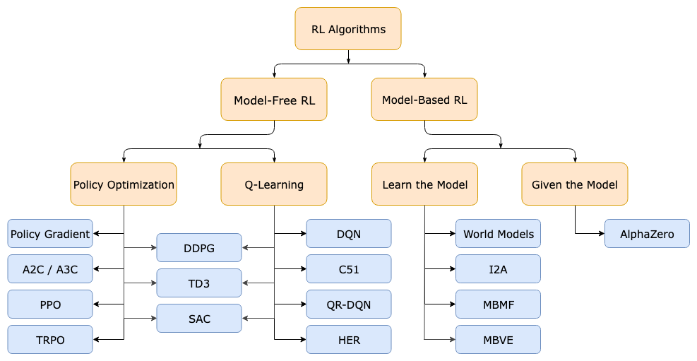
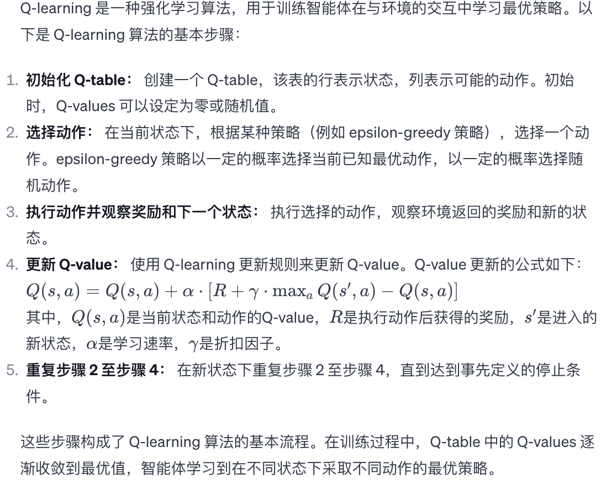
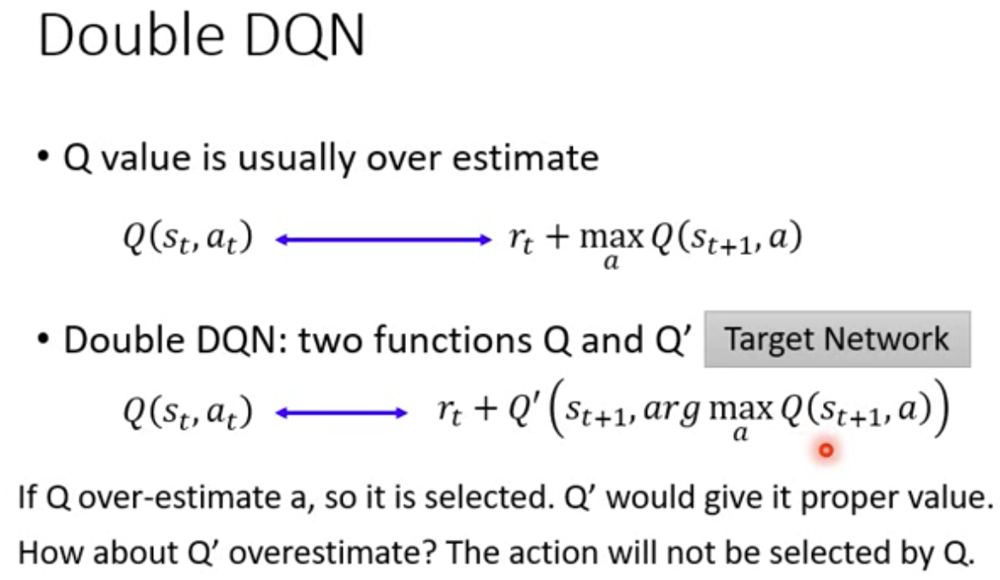
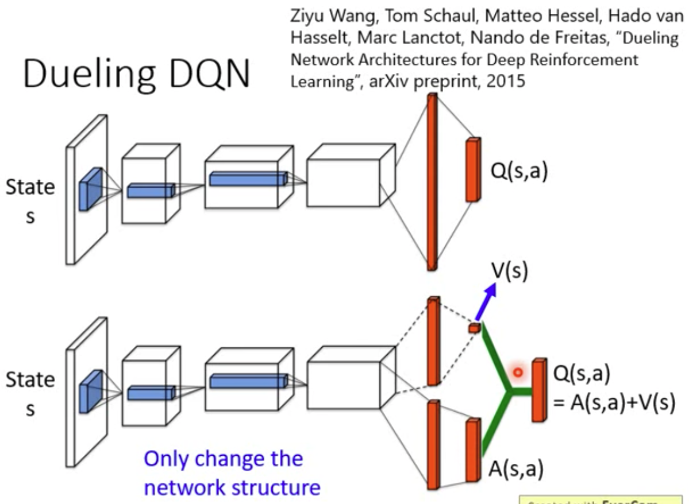

# 算法



## Q-learning

原始的（表格型）在线 Q-learning 算法如下：



### DQN

[1312.5602](https://arxiv.org/abs/1312.5602)（深度强化学习的开山之作）

* $Q^{\pi}(s,a)$ 就是一个 policy：

    $$
    \pi(s)=\arg\max_aQ^{\pi}(s,a)
    $$

* $Q^{\pi}(s,a)$ 是一个深度神经网络，在实现中通常仅输入 s，输出所有 a 对应的 Q 值
* 不适用于 continuous action space

#### replay buffer


#### sb3 实现

```python
while self.num_timesteps < total_timesteps:
    while should_collect_more_steps(train_freq, num_collected_steps, num_collected_episodes):
        # 采样 action，随机或根据 policy
        actions, buffer_actions = self._sample_action(learning_starts, action_noise, env.num_envs)

        new_obs, rewards, dones, infos = env.step(actions)

        # 储存数据到 replay buffer
        self._store_transition(replay_buffer, buffer_actions, new_obs, rewards, dones, infos)

        # 更新 target network，可以设置更新频率
        polyak_update(self.q_net.parameters(), self.q_net_target.parameters(), self.tau)
        polyak_update(self.batch_norm_stats, self.batch_norm_stats_target, 1.0)

        # 更新 exploration schedule
        self.exploration_rate = self.exploration_schedule(self._current_progress_remaining)

    for _ in range(gradient_steps):
        # 从 replay buffer 采样
        replay_data = self.replay_buffer.sample(batch_size, env=self._vec_normalize_env)

        with th.no_grad():
            # Compute the next Q-values using the target network
            next_q_values = self.q_net_target(replay_data.next_observations)
            # Follow greedy policy: use the one with the highest value
            next_q_values, _ = next_q_values.max(dim=1)
            # 1-step TD target
            target_q_values = replay_data.rewards + (1 - replay_data.dones) * self.gamma * next_q_values

        # Get current Q-values estimates
        current_q_values = self.q_net(replay_data.observations)

        # Retrieve the q-values for the actions from the replay buffer
        current_q_values = torch.gather(current_q_values, dim=1, index=replay_data.actions.long())

        # Compute Huber loss (less sensitive to outliers)
        loss = F.smooth_l1_loss(current_q_values, target_q_values)

        # Optimize the policy
        self.policy.optimizer.zero_grad()
        loss.backward()
        self.policy.optimizer.step()
```

### DQN 的变体

#### Double DQN

[1509.06461](https://arxiv.org/abs/1509.06461)

Q-learning 中的 Q 值通常会被高估，称为 maximazation bias。Double DQN 将选择 action 交给 Q 网络，将计算 Q 值交给 Q’ 网络（Q 网络几个 step 之前的副本），以减少 bias。



#### Dueling DQN

[1511.06581](https://arxiv.org/abs/1511.06581)

Dueling DQN 将 Q 分解为与 a 有关的部分和与 a 无关的部分。




