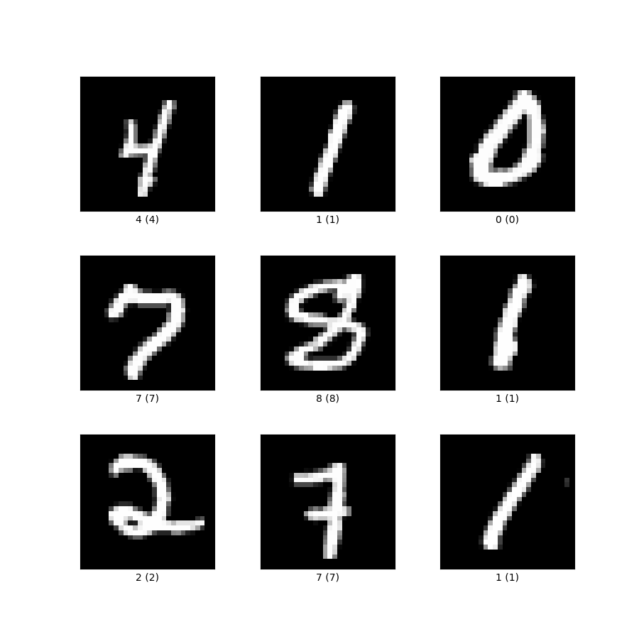

# 强化学习

强化学习（reinforcement learning）是机器学习中的一个领域，强调如何基于环境而行动，以取得最大化的预期利益。

有监督学习（supervised learning）、无监督学习（unsupervised learning）和强化学习三者之间的关系可以参考 ChatGPT 的回答：

有监督学习、无监督学习和强化学习的示例：

## 基本概念

* agent & environment
    * agent 与 environment 进行（多步）交互
    * 在每一步的交互中，agent 对 environment 进行观察，然后决定采取什么行动
    * agent 行动后，environment 会发生变化
* state & observation
    * state $s$ 是对于 environment 的完整描述
    * observation $o$ 是 agent 对于 environment 的观察，是 state 的一部分
    * environment 可以被完全观察或部分观察。
* action & action space
    * action $a$ 是 agent 采取的行动
    * action space 是所有合法 action 的集合
    * action space 可以是连续或离散的
* trajectory/episode/rollout
    * trajectory 是一次（多步）交互的 states & actions 序列：$\tau=(s_0,a_0,s_1,a_1,\cdots)$
    * state transition 可以是确定的或随机的：$s_{t+1}=f(s_t,a_t)$ 或 $s_{t+1}\sim P(\cdot|s_t,a_t)$
* policy
    * policy 是 agent 使用的一套规则，基于此选择 action
    * policy 可以是确定的或随机的：$a_t=\mu(s_t)$ 或 $a_t\simπ(\cdot|s_t)$ 
* reward & return
    * reward 是 agent 每次执行 action 后 environment 返回的一个值：

        $$
        r_t=R(s_t,a_t,s_{t+1})
        $$
        
    * agent 的目标是最大化一个 trajectory 中获得的累计 reward：

        $$
        R(\tau)=\sum_{t=0}^\infty\gamma^tr_t
        $$

        其中折减系数 $\gamma\in(0,1)$

* RL 问题的抽象

    一个 $T$ 步的 trajectory 的出现概率为（马尔可夫假设）：

    $$
    P(\tau|π)=\rho_0(s_0)\prod_{t=0}^{T-1}P(s_{t+1}|s_t,a_t)π(a_t|s_t)
    $$

    expected return 就是：

    $$
    J(π)=\int_\tau P(\tau|π)R(\tau)=\mathop{\mathbb{E}}_{\tau\simπ}[R(\tau)]
    $$

    RL 的核心优化问题就表示为：

    $$
    π^*=\arg\max_π J(π)
    $$

    即强化学习的目标是选择一个 policy，该 policy 在 agent 根据它选择 action 时能够最大化 expected return。

* value function
    * value 是指，从指定的 state（或 state-action pair）开始，根据指定的 policy 选择 action，最终的 expected return
    * value function 在几乎每个强化学习算法中以某种方式被使用
    * on-policy value function 表示如果从状态 $s$ 开始，并且始终根据策略 $π$ 采取行动，那么预期的回报是多少：

        $$
        V^{\pi}(s)=\mathop{\mathbb{E}}_{\tau\simπ}[R(\tau)|s_0=s]
        $$

    * on-policy action-value function（Q-function）表示如果从状态 $s$ 开始，采取任意行动 $a$（该行动可能不是来自策略），然后始终根据策略 $π$ 采取行动，那么预期的回报是多少：

        $$
        Q^{\pi}(s,a)=\mathop{\mathbb{E}}_{\tau\simπ}[R(\tau)|s_0=s,a_0=a]
        $$

    * value function 服从 Bellman 公式：

        $$
        \displaylines{
        V^{\pi}(s)=\mathop{\mathbb{E}}_{a\simπ,s'\sim P}[r(s,a)+\gamma V^\pi(s')]\\
        Q^{\pi}(s,a)=\mathop{\mathbb{E}}_{s'\sim P}[r(s,a)+\gamma \mathop{\mathbb{E}}_{a'\sim\pi}[Q^\pi(s',a')]]
        }
        $$

        其中 $s'\sim P$ 指 $s'\sim P(\cdot|s,a)$，$a\sim\pi$ 指 $a\sim\pi(\cdot|s)$。其基本思想与动态规划类似：当前位置的 value，是期望从当前位置获得的 reward，加上下一位置的 value

    * large value（策略 $\pi$ 不能太差）和 small value 的示例：

        

* advantage function
    * advantage 是指，从指定的 state 开始，选择指定的 action 相比根据 policy 选择 action（假定之后都根据这一 policy 行动）的 expected return 之差。数学上表示为：

        $$
        A^\pi(s,a)=Q^\pi(s,a)-V^\pi(s)
        $$

    * advantage 衡量的是一个 action 相对于其他 action 有多好

